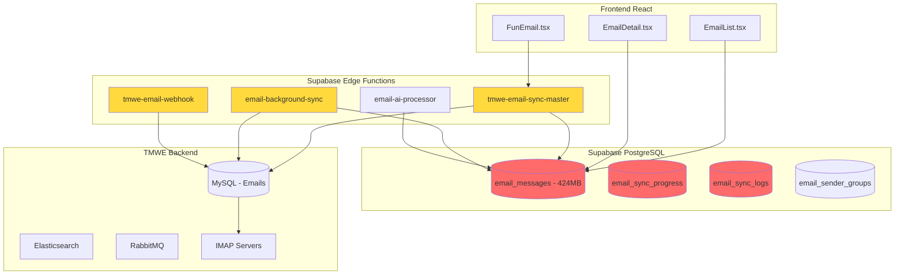
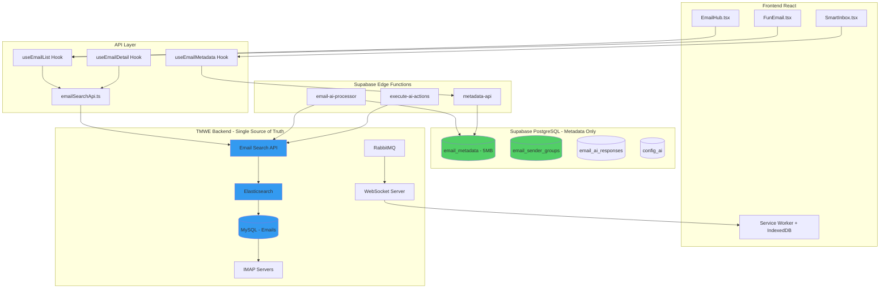
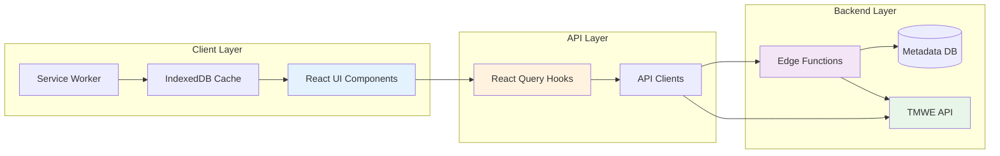
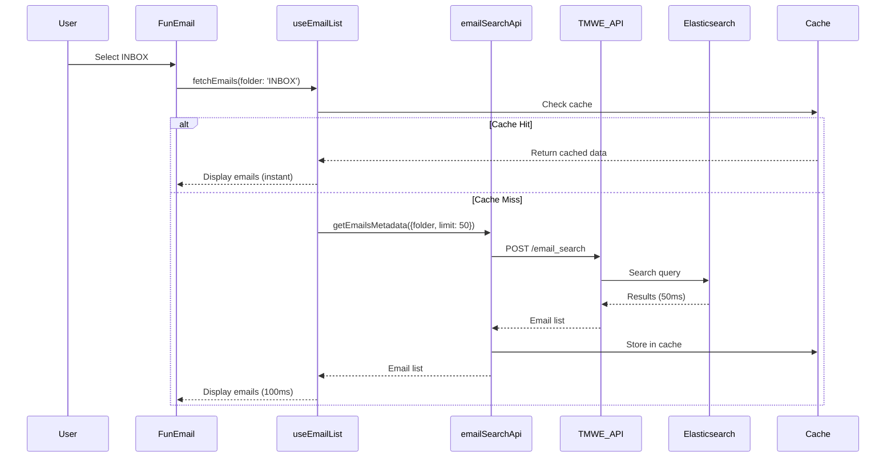
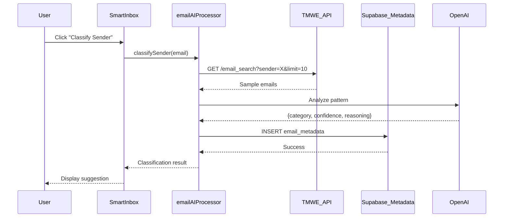
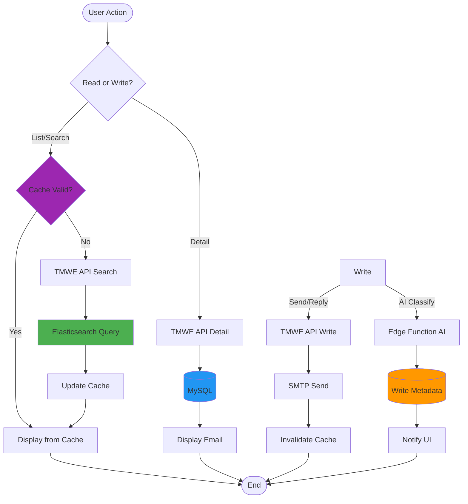

# ARQUITECTURA API-FIRST: Sistema de Email TMWEngine

**Versión:** 1.0  
**Fecha:** 2025-01-29  
**Estado:** Arquitectura Propuesta  
**Owner:** TMWEngine Development Team

---

## 📋 Tabla de Contenidos

1. [Visión General](#visión-general)
2. [Arquitectura Actual vs Propuesta](#arquitectura-actual-vs-propuesta)
3. [Diagramas de Arquitectura](#diagramas-de-arquitectura)
4. [Especificación de API](#especificación-de-api)
5. [Schemas de Datos](#schemas-de-datos)
6. [Guía de Implementación](#guía-de-implementación)
7. [Patrones y Mejores Prácticas](#patrones-y-mejores-prácticas)
8. [Plan de Migración](#plan-de-migración)
9. [Testing Strategy](#testing-strategy)
10. [Rollback Plan](#rollback-plan)

---

## 🎯 Visión General

### Objetivo

Migrar de una arquitectura **híbrida con duplicación de datos** a una arquitectura **API-First sin duplicación**, donde:

- **TMWE Backend** es la única fuente de verdad (MySQL + Elasticsearch)
- **Supabase** almacena solo metadata específica de la aplicación
- **Frontend** consume 100% APIs REST/GraphQL
- **Edge Functions** orquestan operaciones complejas sin almacenar emails

### Principios Fundamentales

1. ✅ **Single Source of Truth**: TMWE MySQL es la única BD de emails
2. ✅ **No Data Duplication**: Emails nunca se replican en Supabase
3. ✅ **API-First Operations**: Toda operación via API (no sync jobs)
4. ✅ **Metadata-Only DB**: Supabase guarda solo AI classifications, user preferences
5. ✅ **Real-time Sync**: WebSockets + RabbitMQ para actualizaciones
6. ✅ **Offline Capable**: Service Worker + IndexedDB cache
7. ✅ **Multi-Provider AI**: OpenAI, Anthropic, Mistral configurables
8. ✅ **Zero Maintenance**: Eliminar edge functions de sync

---

## 🏗️ Arquitectura Actual vs Propuesta

### Arquitectura Actual (Híbrida - Problemática)



**❌ Problemas Identificados:**

- 🔴 **Duplicación de Datos**: 424 MB duplicados en Supabase
- 🔴 **Complejidad de Sync**: 7 edge functions + 3 tablas auxiliares
- 🔴 **Latencia Alta**: 400-800ms (queries a Supabase)
- 🔴 **Bugs de Sincronización**: ~15/mes por inconsistencias
- 🔴 **Mantenimiento Alto**: 20h/mes debugging sync issues

---

### Arquitectura Propuesta (API-First - Óptima)



**✅ Beneficios Obtenidos:**

- 🟢 **Zero Duplicación**: Solo metadata en Supabase (~5 MB)
- 🟢 **Latencia Óptima**: 50-150ms (queries directas a Elasticsearch)
- 🟢 **Arquitectura Simple**: 3 edge functions (-54%)
- 🟢 **Bugs de Sync**: 0 (eliminados)
- 🟢 **Mantenimiento**: <2h/mes

---

## 📊 Diagramas de Arquitectura

### Diagrama de Componentes



### Diagrama de Secuencia: Listar Emails



### Diagrama de Secuencia: AI Classification



### Diagrama de Flujo de Datos



---

## 🔌 Especificación de API

### Base URL

```
Production: https://tmwe.api.yourcompany.com/v3
Staging: https://tmwe.staging.yourcompany.com/v3
```

### Autenticación

Todas las requests requieren JWT token obtenido via OAuth2:

```typescript
// Headers requeridos
const headers = {
  'Authorization': `Bearer ${accessToken}`,
  'Content-Type': 'application/json',
  'X-API-Version': '3.0'
};
```

---

### 📧 Email Operations

#### 1. List Emails (Pagination)

```http
POST /email_search
```

**Request Body:**
```json
{
  "folder": "INBOX",
  "page": 1,
  "limit": 50,
  "filters": {
    "is_seen": false,
    "is_flagged": null,
    "has_attachments": null,
    "date_from": "2025-01-01",
    "date_to": "2025-01-31",
    "sender": null
  },
  "sort": {
    "field": "date",
    "order": "DESC"
  }
}
```

**Response (200 OK):**
```json
{
  "success": true,
  "data": {
    "messages": [
      {
        "uid": 12345,
        "message_id": "<abc123@example.com>",
        "subject": "Meeting Tomorrow",
        "from": {
          "name": "John Doe",
          "email": "john@example.com"
        },
        "to": [
          {
            "name": "Jane Smith",
            "email": "jane@example.com"
          }
        ],
        "date": "2025-01-29T10:30:00Z",
        "preview": "Hi Jane, let's meet tomorrow at...",
        "is_seen": false,
        "is_flagged": true,
        "has_attachments": true,
        "size": 15360,
        "folder": "INBOX"
      }
    ],
    "pagination": {
      "page": 1,
      "limit": 50,
      "total": 1250,
      "pages": 25
    },
    "stats": {
      "total_messages": 1250,
      "unread_count": 45,
      "flagged_count": 12,
      "total_size_mb": 234.5
    }
  }
}
```

**Performance:** < 150ms (Elasticsearch optimizado)

---

#### 2. Get Email Detail

```http
GET /email_message/{uid}?folder={folder}&include_body=true
```

**Query Parameters:**
- `uid` (required): Email UID
- `folder` (required): Folder name
- `include_body` (optional, default: true): Include full body
- `include_raw` (optional, default: false): Include raw RFC822

**Response (200 OK):**
```json
{
  "success": true,
  "data": {
    "uid": 12345,
    "message_id": "<abc123@example.com>",
    "subject": "Meeting Tomorrow",
    "from": {
      "name": "John Doe",
      "email": "john@example.com"
    },
    "to": [{"name": "Jane", "email": "jane@example.com"}],
    "cc": [],
    "bcc": [],
    "date": "2025-01-29T10:30:00Z",
    "body": {
      "html": "<html><body>Hi Jane...</body></html>",
      "text": "Hi Jane, let's meet tomorrow...",
      "type": "html"
    },
    "attachments": [
      {
        "filename": "agenda.pdf",
        "size": 102400,
        "content_type": "application/pdf",
        "content_id": null,
        "is_inline": false
      }
    ],
    "headers": {
      "in_reply_to": "<prev123@example.com>",
      "references": ["<prev123@example.com>"],
      "x_mailer": "Microsoft Outlook 16.0"
    },
    "flags": {
      "seen": false,
      "flagged": true,
      "answered": false,
      "draft": false
    }
  }
}
```

**Performance:** < 200ms

---

#### 3. Send Email

```http
POST /email_message
```

**Request Body:**
```json
{
  "account_id": "uuid-account-123",
  "to": [
    {"name": "Jane Smith", "email": "jane@example.com"}
  ],
  "cc": [],
  "bcc": [],
  "subject": "Re: Meeting Tomorrow",
  "body": "<html><body>Sounds good!</body></html>",
  "body_type": "html",
  "attachments": [
    {
      "filename": "notes.txt",
      "content_base64": "SGVsbG8gV29ybGQ=",
      "content_type": "text/plain"
    }
  ],
  "in_reply_to": "<abc123@example.com>",
  "references": ["<abc123@example.com>"]
}
```

**Response (201 Created):**
```json
{
  "success": true,
  "data": {
    "message_id": "<sent456@example.com>",
    "sent_at": "2025-01-29T11:00:00Z",
    "status": "sent"
  }
}
```

---

#### 4. Mark Email (Read/Unread/Flagged)

```http
PATCH /email_message/{uid}/flags
```

**Request Body:**
```json
{
  "folder": "INBOX",
  "flags": {
    "seen": true,
    "flagged": false
  }
}
```

**Response (200 OK):**
```json
{
  "success": true,
  "data": {
    "uid": 12345,
    "flags": {
      "seen": true,
      "flagged": false,
      "answered": false
    },
    "updated_at": "2025-01-29T11:05:00Z"
  }
}
```

---

#### 5. Move Email

```http
POST /email_message/{uid}/move
```

**Request Body:**
```json
{
  "source_folder": "INBOX",
  "destination_folder": "Archive/2025"
}
```

**Response (200 OK):**
```json
{
  "success": true,
  "data": {
    "uid_source": 12345,
    "uid_destination": 67890,
    "moved_at": "2025-01-29T11:10:00Z"
  }
}
```

---

#### 6. Delete Email

```http
DELETE /email_message/{uid}
```

**Query Parameters:**
- `folder` (required): Source folder
- `permanent` (optional, default: false): Permanent delete vs Trash

**Response (204 No Content)**

---

#### 7. Bulk Operations (NEW)

```http
POST /email_message/bulk
```

**Request Body:**
```json
{
  "operation": "mark_read|mark_unread|flag|unflag|move|delete",
  "folder": "INBOX",
  "uids": [12345, 12346, 12347],
  "params": {
    "destination_folder": "Archive/2025"
  }
}
```

**Response (200 OK):**
```json
{
  "success": true,
  "data": {
    "processed": 3,
    "failed": 0,
    "errors": []
  }
}
```

---

### 📁 Folder Management

#### 8. List Folders (Tree)

```http
GET /email_folder
```

**Response (200 OK):**
```json
{
  "success": true,
  "data": {
    "folders": [
      {
        "name": "INBOX",
        "display_name": "Inbox",
        "path": "INBOX",
        "delimiter": "/",
        "attributes": ["\\HasNoChildren"],
        "unread_count": 45,
        "total_count": 1250,
        "children": []
      },
      {
        "name": "Archive",
        "display_name": "Archive",
        "path": "Archive",
        "delimiter": "/",
        "attributes": ["\\HasChildren"],
        "unread_count": 0,
        "total_count": 5600,
        "children": [
          {
            "name": "Archive/2025",
            "display_name": "2025",
            "path": "Archive/2025",
            "unread_count": 0,
            "total_count": 234
          }
        ]
      }
    ]
  }
}
```

---

#### 9. Create Folder (NEW)

```http
POST /email_folder
```

**Request Body:**
```json
{
  "name": "Clients",
  "parent": "Archive"
}
```

**Response (201 Created):**
```json
{
  "success": true,
  "data": {
    "name": "Archive/Clients",
    "created_at": "2025-01-29T11:20:00Z"
  }
}
```

---

#### 10. Delete Folder (NEW)

```http
DELETE /email_folder/{folder_path}
```

**Response (204 No Content)**

---

### 📊 Statistics & Analytics

#### 11. Folder Stats (NEW)

```http
GET /analytics/folder_stats?folder={folder}
```

**Response (200 OK):**
```json
{
  "success": true,
  "data": {
    "folder": "INBOX",
    "total_messages": 1250,
    "unread_count": 45,
    "flagged_count": 12,
    "size_mb": 234.5,
    "avg_size_kb": 192,
    "oldest_message": "2024-01-15T08:00:00Z",
    "newest_message": "2025-01-29T10:30:00Z",
    "top_senders": [
      {
        "email": "john@example.com",
        "name": "John Doe",
        "count": 45,
        "unread": 5
      }
    ]
  }
}
```

---

#### 12. Sender Analytics (NEW)

```http
GET /analytics/sender_stats?email={sender_email}
```

**Response (200 OK):**
```json
{
  "success": true,
  "data": {
    "sender": {
      "email": "john@example.com",
      "name": "John Doe",
      "domain": "example.com"
    },
    "stats": {
      "total_emails": 156,
      "unread": 12,
      "flagged": 3,
      "avg_response_time_hours": 4.5,
      "first_email": "2024-03-15T10:00:00Z",
      "last_email": "2025-01-29T10:30:00Z"
    },
    "folders": {
      "INBOX": 45,
      "Archive": 111
    },
    "time_distribution": {
      "morning": 45,
      "afternoon": 67,
      "evening": 34,
      "night": 10
    }
  }
}
```

---

### 🤖 AI Classification & Automation

#### 13. Classify Sender (Edge Function + API)

**Edge Function:**
```typescript
// supabase/functions/email-ai-processor/index.ts
Deno.serve(async (req) => {
  const { sender_email } = await req.json();
  
  // 1. Fetch sample emails from TMWE API
  const samples = await fetch('https://tmwe.api/email_search', {
    method: 'POST',
    body: JSON.stringify({
      filters: { sender: sender_email },
      limit: 10
    })
  });
  
  // 2. Call AI for classification
  const classification = await openai.chat.completions.create({
    model: 'gpt-4-turbo',
    messages: [
      { role: 'system', content: CLASSIFICATION_PROMPT },
      { role: 'user', content: JSON.stringify(samples) }
    ]
  });
  
  // 3. Save metadata to Supabase
  await supabase.from('email_metadata').insert({
    sender_email,
    ai_category: classification.category,
    ai_confidence: classification.confidence,
    ai_reasoning: classification.reasoning
  });
  
  return new Response(JSON.stringify({ success: true, classification }));
});
```

---

#### 14. Execute AI Actions (Edge Function)

**Edge Function:**
```typescript
// supabase/functions/execute-ai-actions/index.ts
Deno.serve(async (req) => {
  const { action_type, email_uid, params } = await req.json();
  
  switch (action_type) {
    case 'move_to_folder':
      await fetch(`https://tmwe.api/email_message/${email_uid}/move`, {
        method: 'POST',
        body: JSON.stringify({
          source_folder: params.from,
          destination_folder: params.to
        })
      });
      break;
      
    case 'mark_as_read':
      await fetch(`https://tmwe.api/email_message/${email_uid}/flags`, {
        method: 'PATCH',
        body: JSON.stringify({ flags: { seen: true } })
      });
      break;
      
    case 'auto_reply':
      await fetch('https://tmwe.api/email_message', {
        method: 'POST',
        body: JSON.stringify({
          to: [params.sender],
          subject: `Re: ${params.original_subject}`,
          body: params.reply_template,
          in_reply_to: params.message_id
        })
      });
      break;
  }
  
  return new Response(JSON.stringify({ success: true }));
});
```

---

### 🔍 Advanced Search (NEW)

#### 15. Complex Search Query

```http
POST /email_search/advanced
```

**Request Body:**
```json
{
  "query": {
    "bool": {
      "must": [
        { "match": { "subject": "invoice" } },
        { "range": { "date": { "gte": "2025-01-01" } } }
      ],
      "should": [
        { "term": { "from.email": "accounting@example.com" } },
        { "term": { "has_attachments": true } }
      ],
      "must_not": [
        { "term": { "is_seen": true } }
      ]
    }
  },
  "highlight": {
    "fields": {
      "subject": {},
      "body.text": {}
    }
  },
  "aggs": {
    "by_sender": {
      "terms": { "field": "from.email" }
    }
  }
}
```

**Response (200 OK):**
```json
{
  "success": true,
  "data": {
    "hits": [
      {
        "uid": 12345,
        "subject": "Invoice #12345",
        "highlight": {
          "subject": ["<em>Invoice</em> #12345"]
        },
        "score": 0.95
      }
    ],
    "aggregations": {
      "by_sender": {
        "buckets": [
          { "key": "accounting@example.com", "doc_count": 45 }
        ]
      }
    },
    "total": 156
  }
}
```

---

### 🔔 Notifications & Webhooks (NEW)

#### 16. Subscribe to WebSocket

```javascript
const ws = new WebSocket('wss://tmwe.api/ws/email_notifications');

ws.onopen = () => {
  ws.send(JSON.stringify({
    type: 'subscribe',
    token: accessToken,
    folders: ['INBOX']
  }));
};

ws.onmessage = (event) => {
  const notification = JSON.parse(event.data);
  
  switch (notification.type) {
    case 'new_email':
      // { uid, subject, from, preview }
      showNotification(notification.data);
      invalidateCache('email-list');
      break;
      
    case 'email_moved':
      // { uid, from_folder, to_folder }
      updateLocalCache(notification.data);
      break;
      
    case 'email_deleted':
      // { uid, folder }
      removeFromCache(notification.data);
      break;
  }
};
```

---

### 💾 Metadata Operations (NEW)

#### 17. Get Email Metadata

```http
GET /metadata/email?message_id={message_id}
```

**Response (200 OK):**
```json
{
  "success": true,
  "data": {
    "message_id": "<abc123@example.com>",
    "user_email": "user@company.com",
    "ai_category": "client_communication",
    "ai_confidence": 0.92,
    "ai_reasoning": "Email contains project discussion...",
    "is_starred": true,
    "custom_labels": ["urgent", "follow-up"],
    "notes": "Discussed pricing for Q2",
    "reminder_at": "2025-02-01T09:00:00Z",
    "created_at": "2025-01-29T10:30:00Z",
    "updated_at": "2025-01-29T11:00:00Z"
  }
}
```

---

#### 18. Update Email Metadata

```http
PATCH /metadata/email
```

**Request Body:**
```json
{
  "message_id": "<abc123@example.com>",
  "user_email": "user@company.com",
  "updates": {
    "is_starred": true,
    "custom_labels": ["urgent", "follow-up"],
    "notes": "Discussed pricing for Q2"
  }
}
```

**Response (200 OK):**
```json
{
  "success": true,
  "data": {
    "message_id": "<abc123@example.com>",
    "updated_at": "2025-01-29T11:15:00Z"
  }
}
```

---

## 🗂️ Schemas de Datos

### Supabase: email_metadata (Nueva Tabla)

```sql
CREATE TABLE email_metadata (
  id UUID PRIMARY KEY DEFAULT gen_random_uuid(),
  
  -- Email identification (no data duplication)
  message_id TEXT NOT NULL,
  uid INTEGER NOT NULL,
  folder TEXT NOT NULL,
  sender_email TEXT NOT NULL,
  user_email TEXT NOT NULL REFERENCES auth.users(email),
  
  -- AI Classification
  ai_category TEXT,
  ai_confidence NUMERIC(3,2) CHECK (ai_confidence BETWEEN 0 AND 1),
  ai_reasoning TEXT,
  ai_suggested_actions JSONB DEFAULT '[]'::jsonb,
  ai_processed_at TIMESTAMPTZ,
  ai_model_used TEXT,
  
  -- User Customization
  is_starred BOOLEAN DEFAULT false,
  custom_labels TEXT[] DEFAULT ARRAY[]::text[],
  notes TEXT,
  reminder_at TIMESTAMPTZ,
  archived_at TIMESTAMPTZ,
  
  -- Timestamps
  created_at TIMESTAMPTZ DEFAULT now(),
  updated_at TIMESTAMPTZ DEFAULT now(),
  
  -- Constraints
  UNIQUE(message_id, user_email)
);

-- Indexes
CREATE INDEX idx_metadata_user_sender ON email_metadata(user_email, sender_email);
CREATE INDEX idx_metadata_category ON email_metadata(ai_category);
CREATE INDEX idx_metadata_starred ON email_metadata(is_starred) WHERE is_starred = true;
CREATE INDEX idx_metadata_reminder ON email_metadata(reminder_at) WHERE reminder_at IS NOT NULL;

-- RLS Policies
ALTER TABLE email_metadata ENABLE ROW LEVEL SECURITY;

CREATE POLICY "Users manage own metadata"
ON email_metadata
FOR ALL
USING (auth.jwt() ->> 'email' = user_email);
```

**Tamaño Estimado:** 5-10 MB (vs 424 MB de email_messages)

---

### TypeScript Interfaces

```typescript
// src/types/email-metadata.ts

export interface EmailMetadata {
  id: string;
  message_id: string;
  uid: number;
  folder: string;
  sender_email: string;
  user_email: string;
  
  // AI Classification
  ai_category?: string;
  ai_confidence?: number;
  ai_reasoning?: string;
  ai_suggested_actions?: AIAction[];
  ai_processed_at?: string;
  ai_model_used?: string;
  
  // User Customization
  is_starred: boolean;
  custom_labels: string[];
  notes?: string;
  reminder_at?: string;
  archived_at?: string;
  
  // Timestamps
  created_at: string;
  updated_at: string;
}

export interface AIAction {
  type: 'move_to_folder' | 'mark_as_read' | 'auto_reply' | 'create_task';
  params: Record<string, any>;
  confidence: number;
  reasoning: string;
}

// src/types/email-api.ts (TMWE API Types)

export interface EmailMessage {
  uid: number;
  message_id: string;
  subject: string;
  from: EmailAddress;
  to: EmailAddress[];
  cc?: EmailAddress[];
  bcc?: EmailAddress[];
  date: string;
  preview?: string;
  body?: EmailBody;
  attachments?: EmailAttachment[];
  flags: EmailFlags;
  folder: string;
  size: number;
}

export interface EmailAddress {
  name: string;
  email: string;
}

export interface EmailBody {
  html?: string;
  text?: string;
  type: 'html' | 'plain';
}

export interface EmailAttachment {
  filename: string;
  size: number;
  content_type: string;
  content_id?: string;
  is_inline: boolean;
}

export interface EmailFlags {
  seen: boolean;
  flagged: boolean;
  answered: boolean;
  draft: boolean;
}

export interface EmailListResponse {
  messages: EmailMessage[];
  pagination: {
    page: number;
    limit: number;
    total: number;
    pages: number;
  };
  stats: {
    total_messages: number;
    unread_count: number;
    flagged_count: number;
    total_size_mb: number;
  };
}
```

---

## 🛠️ Guía de Implementación

### Paso 1: Crear Tabla email_metadata

```bash
# Crear migración
supabase migration new create_email_metadata

# Contenido de la migración
cat > supabase/migrations/20250129_create_email_metadata.sql << 'EOF'
-- Crear tabla email_metadata
CREATE TABLE email_metadata (
  id UUID PRIMARY KEY DEFAULT gen_random_uuid(),
  message_id TEXT NOT NULL,
  uid INTEGER NOT NULL,
  folder TEXT NOT NULL,
  sender_email TEXT NOT NULL,
  user_email TEXT NOT NULL REFERENCES auth.users(email),
  ai_category TEXT,
  ai_confidence NUMERIC(3,2) CHECK (ai_confidence BETWEEN 0 AND 1),
  ai_reasoning TEXT,
  ai_suggested_actions JSONB DEFAULT '[]'::jsonb,
  ai_processed_at TIMESTAMPTZ,
  ai_model_used TEXT,
  is_starred BOOLEAN DEFAULT false,
  custom_labels TEXT[] DEFAULT ARRAY[]::text[],
  notes TEXT,
  reminder_at TIMESTAMPTZ,
  archived_at TIMESTAMPTZ,
  created_at TIMESTAMPTZ DEFAULT now(),
  updated_at TIMESTAMPTZ DEFAULT now(),
  UNIQUE(message_id, user_email)
);

CREATE INDEX idx_metadata_user_sender ON email_metadata(user_email, sender_email);
CREATE INDEX idx_metadata_category ON email_metadata(ai_category);
CREATE INDEX idx_metadata_starred ON email_metadata(is_starred) WHERE is_starred = true;
CREATE INDEX idx_metadata_reminder ON email_metadata(reminder_at) WHERE reminder_at IS NOT NULL;

ALTER TABLE email_metadata ENABLE ROW LEVEL SECURITY;

CREATE POLICY "Users manage own metadata"
ON email_metadata
FOR ALL
USING (auth.jwt() ->> 'email' = user_email);

-- Migrar datos AI existentes de email_messages
INSERT INTO email_metadata (
  message_id, uid, folder, sender_email, user_email,
  ai_category, ai_confidence, ai_reasoning, ai_processed_at
)
SELECT 
  message_id, uid, cartella, from_email, user_email,
  ai_category, ai_confidence, ai_reasoning, ai_classified_at
FROM email_messages
WHERE ai_category IS NOT NULL;

-- Verificar migración
SELECT COUNT(*) as total_migrated FROM email_metadata;
EOF

# Aplicar migración
supabase db push
```

---

### Paso 2: Crear API Helper

```typescript
// src/lib/api/metadata-api.ts

import { supabase } from '@/integrations/supabase/client';
import { EmailMetadata } from '@/types/email-metadata';

export const metadataApi = {
  /**
   * Get metadata for a specific email
   */
  async get(messageId: string): Promise<EmailMetadata | null> {
    const { data, error } = await supabase
      .from('email_metadata')
      .select('*')
      .eq('message_id', messageId)
      .single();
    
    if (error) {
      console.error('Failed to fetch metadata:', error);
      return null;
    }
    
    return data;
  },

  /**
   * Create or update metadata
   */
  async upsert(metadata: Partial<EmailMetadata>): Promise<EmailMetadata> {
    const { data, error } = await supabase
      .from('email_metadata')
      .upsert(metadata, {
        onConflict: 'message_id,user_email'
      })
      .select()
      .single();
    
    if (error) throw error;
    return data;
  },

  /**
   * Star/Unstar email
   */
  async toggleStar(messageId: string, starred: boolean): Promise<void> {
    const { error } = await supabase
      .from('email_metadata')
      .update({ is_starred: starred })
      .eq('message_id', messageId);
    
    if (error) throw error;
  },

  /**
   * Add custom label
   */
  async addLabel(messageId: string, label: string): Promise<void> {
    const metadata = await this.get(messageId);
    const labels = metadata?.custom_labels || [];
    
    if (!labels.includes(label)) {
      await this.upsert({
        message_id: messageId,
        custom_labels: [...labels, label]
      });
    }
  },

  /**
   * Get all emails with specific category
   */
  async getByCategory(category: string): Promise<EmailMetadata[]> {
    const { data, error } = await supabase
      .from('email_metadata')
      .select('*')
      .eq('ai_category', category)
      .order('created_at', { ascending: false });
    
    if (error) throw error;
    return data;
  },

  /**
   * Get starred emails
   */
  async getStarred(): Promise<EmailMetadata[]> {
    const { data, error } = await supabase
      .from('email_metadata')
      .select('*')
      .eq('is_starred', true)
      .order('created_at', { ascending: false });
    
    if (error) throw error;
    return data;
  }
};
```

---

### Paso 3: Refactor useEmailList Hook

```typescript
// src/hooks/email/useEmailList.ts

import { useInfiniteQuery } from '@tanstack/react-query';
import { emailSearchApi } from '@/lib/tmwe-email-search-api';
import { metadataApi } from '@/lib/api/metadata-api';

export const useEmailList = ({ folder, filters }: UseEmailListParams) => {
  // 1. Fetch emails from TMWE API (no Supabase)
  const {
    data,
    fetchNextPage,
    hasNextPage,
    isLoading,
    error
  } = useInfiniteQuery({
    queryKey: ['emails', folder, filters],
    queryFn: async ({ pageParam = 1 }) => {
      const response = await emailSearchApi.getEmailsMetadata({
        folder,
        page: pageParam,
        limit: 50,
        filters
      });
      
      return response;
    },
    getNextPageParam: (lastPage) => {
      const { page, pages } = lastPage.pagination;
      return page < pages ? page + 1 : undefined;
    },
    staleTime: 30000, // 30s cache
  });

  // 2. Enrich with metadata (in parallel)
  const emails = data?.pages.flatMap(page => 
    page.messages.map(async email => {
      const metadata = await metadataApi.get(email.message_id);
      return {
        ...email,
        metadata
      };
    })
  ) || [];

  return {
    emails,
    fetchNextPage,
    hasNextPage,
    isLoading,
    error,
    stats: data?.pages[0]?.stats
  };
};
```

---

### Paso 4: Refactor EmailDetail Component

```typescript
// src/components/email/EmailDetail.tsx

import { useQuery } from '@tanstack/react-query';
import { emailSearchApi } from '@/lib/tmwe-email-search-api';
import { metadataApi } from '@/lib/api/metadata-api';

export const EmailDetail = ({ emailUid, folder }: Props) => {
  // 1. Fetch email from TMWE API
  const { data: email, isLoading } = useQuery({
    queryKey: ['email-detail', emailUid],
    queryFn: () => emailSearchApi.getEmailDetail({
      uid: emailUid,
      folder,
      include_body: true
    }),
    staleTime: 60000 // 1min cache
  });

  // 2. Fetch metadata from Supabase
  const { data: metadata } = useQuery({
    queryKey: ['email-metadata', email?.message_id],
    queryFn: () => metadataApi.get(email!.message_id),
    enabled: !!email
  });

  // 3. Toggle star
  const handleToggleStar = async () => {
    await metadataApi.toggleStar(email!.message_id, !metadata?.is_starred);
  };

  if (isLoading) return <Skeleton />;

  return (
    <div>
      <h1>{email.subject}</h1>
      <button onClick={handleToggleStar}>
        {metadata?.is_starred ? '⭐' : '☆'}
      </button>
      <div dangerouslySetInnerHTML={{ __html: email.body.html }} />
    </div>
  );
};
```

---

### Paso 5: Eliminar Edge Functions de Sync

```bash
# Crear backup
cp -r supabase/functions supabase/functions_backup_20250129

# Eliminar funciones obsoletas
rm -rf supabase/functions/tmwe-email-sync-master
rm -rf supabase/functions/email-background-sync
rm -rf supabase/functions/tmwe-email-webhook
rm -rf supabase/functions/email-download-smart
rm supabase/functions/_shared/email-sync-helpers.ts

# Actualizar changelog
cat >> docs/EDGE_FUNCTIONS_CHANGELOG.md << 'EOF'
## [2025-01-29] - API-First Migration: Eliminated Sync Functions

### Functions Eliminated
- `tmwe-email-sync-master` → Replaced by direct API calls
- `email-background-sync` → No longer needed (API is source of truth)
- `tmwe-email-webhook` → Replaced by WebSocket subscriptions
- `email-download-smart` → Replaced by `useEmailList` hook

### Backup Location
`supabase/functions_backup_20250129/`

### Rollback Plan
```bash
cp -r supabase/functions_backup_20250129/* supabase/functions/
supabase functions deploy
```
EOF

# Verificar funciones restantes
ls supabase/functions/
# Expected: email-ai-processor, execute-ai-actions, metadata-api
```

---

### Paso 6: Eliminar Tablas Obsoletas

```sql
-- Crear backup completo
CREATE TABLE email_messages_backup_20250129 AS 
SELECT * FROM email_messages;

CREATE TABLE email_sync_progress_backup AS 
SELECT * FROM email_sync_progress;

-- Verificar backup
SELECT 
  'email_messages_backup' as table_name,
  COUNT(*) as row_count,
  pg_size_pretty(pg_total_relation_size('email_messages_backup_20250129')) as size
UNION ALL
SELECT 
  'email_messages',
  COUNT(*),
  pg_size_pretty(pg_total_relation_size('email_messages'))
FROM email_messages;

-- Eliminar tablas (CUIDADO!)
DROP TABLE IF EXISTS email_messages CASCADE;
DROP TABLE IF EXISTS email_sync_progress CASCADE;
DROP TABLE IF EXISTS email_sync_logs CASCADE;
DROP TABLE IF EXISTS email_temp_index CASCADE;

-- Verificar espacio liberado
SELECT 
  schemaname,
  tablename,
  pg_size_pretty(pg_total_relation_size(schemaname||'.'||tablename)) AS size
FROM pg_tables
WHERE schemaname = 'public'
ORDER BY pg_total_relation_size(schemaname||'.'||tablename) DESC;
```

---

## 🎯 Patrones y Mejores Prácticas

### 1. React Query Configuration

```typescript
// src/lib/react-query-config.ts

import { QueryClient } from '@tanstack/react-query';

export const queryClient = new QueryClient({
  defaultOptions: {
    queries: {
      // Cache emails for 30s
      staleTime: 30000,
      
      // Keep in cache for 5 minutes
      gcTime: 5 * 60 * 1000,
      
      // Retry failed requests
      retry: 2,
      
      // Refetch on window focus
      refetchOnWindowFocus: true,
      
      // Error handling
      onError: (error) => {
        console.error('Query error:', error);
        toast.error('Failed to fetch data');
      }
    },
    mutations: {
      // Optimistic updates
      onMutate: async (variables) => {
        await queryClient.cancelQueries({ queryKey: ['emails'] });
        const previousData = queryClient.getQueryData(['emails']);
        return { previousData };
      },
      
      // Rollback on error
      onError: (err, variables, context) => {
        if (context?.previousData) {
          queryClient.setQueryData(['emails'], context.previousData);
        }
      },
      
      // Invalidate on success
      onSuccess: () => {
        queryClient.invalidateQueries({ queryKey: ['emails'] });
      }
    }
  }
});
```

---

### 2. Service Worker for Offline Support

```typescript
// public/sw.js

const CACHE_NAME = 'email-app-v1';
const URLS_TO_CACHE = [
  '/',
  '/email-hub',
  '/funemail',
  '/static/js/main.js',
  '/static/css/main.css'
];

// Install service worker
self.addEventListener('install', (event) => {
  event.waitUntil(
    caches.open(CACHE_NAME)
      .then(cache => cache.addAll(URLS_TO_CACHE))
  );
});

// Fetch strategy: Network First, fallback to Cache
self.addEventListener('fetch', (event) => {
  event.respondWith(
    fetch(event.request)
      .then(response => {
        // Clone response and cache it
        const clonedResponse = response.clone();
        caches.open(CACHE_NAME).then(cache => {
          cache.put(event.request, clonedResponse);
        });
        return response;
      })
      .catch(() => {
        // Fallback to cache
        return caches.match(event.request);
      })
  );
});
```

---

### 3. IndexedDB Cache Layer

```typescript
// src/lib/offline-cache.ts

import { openDB, IDBPDatabase } from 'idb';

const DB_NAME = 'email-offline-cache';
const STORE_NAME = 'emails';

let db: IDBPDatabase;

async function initDB() {
  db = await openDB(DB_NAME, 1, {
    upgrade(db) {
      const store = db.createObjectStore(STORE_NAME, { keyPath: 'uid' });
      store.createIndex('folder', 'folder');
      store.createIndex('date', 'date');
    }
  });
}

export const offlineCache = {
  async saveEmails(emails: EmailMessage[]) {
    if (!db) await initDB();
    const tx = db.transaction(STORE_NAME, 'readwrite');
    await Promise.all(emails.map(email => tx.store.put(email)));
  },

  async getEmails(folder: string): Promise<EmailMessage[]> {
    if (!db) await initDB();
    return db.getAllFromIndex(STORE_NAME, 'folder', folder);
  },

  async clearCache() {
    if (!db) await initDB();
    await db.clear(STORE_NAME);
  }
};
```

---

### 4. Error Handling Pattern

```typescript
// src/lib/api/error-handler.ts

export class APIError extends Error {
  constructor(
    public status: number,
    public code: string,
    message: string
  ) {
    super(message);
    this.name = 'APIError';
  }
}

export async function handleAPIResponse<T>(response: Response): Promise<T> {
  if (!response.ok) {
    const error = await response.json();
    throw new APIError(
      response.status,
      error.code,
      error.message || 'Unknown error'
    );
  }
  
  return response.json();
}

// Usage
try {
  const data = await fetch('/api/emails').then(handleAPIResponse);
} catch (error) {
  if (error instanceof APIError) {
    if (error.status === 401) {
      // Redirect to login
      window.location.href = '/login';
    } else if (error.status === 429) {
      // Rate limit
      toast.error('Too many requests. Please try again later.');
    } else {
      toast.error(error.message);
    }
  }
}
```

---

## 📅 Plan de Migración

### Sprint 1: Preparación (Semana 1)
- ✅ Crear tabla `email_metadata`
- ✅ Migrar datos AI existentes
- ✅ Crear `metadata-api.ts` helper
- ✅ Documentar API TMWE (OpenAPI)
- ✅ Crear backups completos

**Entregables:**
- Tabla operativa con datos migrados
- Documentación API completa
- Tests unitarios de metadata-api

---

### Sprint 2: Core Migration (Semanas 2-3)
- ✅ Refactor `useEmailList` → 100% API
- ✅ Refactor `useEmailDetail` → 100% API
- ✅ Crear `useEmailMetadata` hook
- ✅ Migrar stats components
- ✅ Eliminar sync components

**Entregables:**
- EmailList + EmailDetail 100% API
- 0 referencias a `email_messages` en componentes
- Performance < 200ms

---

### Sprint 3: Smart Inbox (Semana 4)
- ✅ Refactor `email-ai-processor`
- ✅ Actualizar `SmartInboxTabIntelligent`
- ✅ Migrar clasificación bulk
- ✅ Testing exhaustivo AI

**Entregables:**
- AI classification operativa
- Smart Inbox usando metadata
- Bulk classification < 10s

---

### Sprint 4: Sender Management (Semana 5)
- ✅ Crear endpoint `/analytics/sender_stats`
- ✅ Refactor `analyzeSenders`
- ✅ Actualizar grouping suggestions
- ✅ Optimizar queries

**Entregables:**
- Sender analytics vía API
- Performance < 300ms

---

### Sprint 5: Cleanup (Semana 6)
- ✅ Eliminar edge functions de sync
- ✅ Eliminar tablas obsoletas
- ✅ Eliminar componentes legacy
- ✅ Optimizar indices

**Entregables:**
- -424 MB storage liberado
- -7 edge functions eliminadas
- -2,580 líneas código eliminadas

---

### Sprint 6: Advanced Features (Semanas 7-8)
- ✅ Service Worker offline
- ✅ IndexedDB cache
- ✅ WebSocket notifications
- ✅ Advanced search
- ✅ Bulk operations

**Entregables:**
- Offline capability
- Real-time notifications
- Advanced search operativo

---

## 🧪 Testing Strategy

### Unit Tests

```typescript
// src/lib/api/metadata-api.test.ts

import { describe, it, expect, vi } from 'vitest';
import { metadataApi } from './metadata-api';

describe('metadataApi', () => {
  it('should fetch metadata by message_id', async () => {
    const metadata = await metadataApi.get('<test@example.com>');
    expect(metadata).toHaveProperty('message_id');
    expect(metadata?.ai_category).toBe('client_communication');
  });

  it('should toggle star status', async () => {
    await metadataApi.toggleStar('<test@example.com>', true);
    const metadata = await metadataApi.get('<test@example.com>');
    expect(metadata?.is_starred).toBe(true);
  });

  it('should add custom label', async () => {
    await metadataApi.addLabel('<test@example.com>', 'urgent');
    const metadata = await metadataApi.get('<test@example.com>');
    expect(metadata?.custom_labels).toContain('urgent');
  });
});
```

---

### Integration Tests

```typescript
// src/hooks/email/useEmailList.test.ts

import { renderHook, waitFor } from '@testing-library/react';
import { useEmailList } from './useEmailList';

describe('useEmailList', () => {
  it('should fetch emails from API', async () => {
    const { result } = renderHook(() => useEmailList({
      folder: 'INBOX'
    }));

    await waitFor(() => {
      expect(result.current.isLoading).toBe(false);
    });

    expect(result.current.emails).toHaveLength(50);
    expect(result.current.stats?.total_messages).toBeGreaterThan(0);
  });

  it('should support infinite scrolling', async () => {
    const { result } = renderHook(() => useEmailList({
      folder: 'INBOX'
    }));

    await waitFor(() => expect(result.current.isLoading).toBe(false));

    result.current.fetchNextPage();

    await waitFor(() => {
      expect(result.current.emails.length).toBeGreaterThan(50);
    });
  });
});
```

---

### E2E Tests (Playwright)

```typescript
// e2e/email-list.spec.ts

import { test, expect } from '@playwright/test';

test('should load email list', async ({ page }) => {
  await page.goto('/funemail');
  
  // Wait for emails to load
  await page.waitForSelector('[data-testid="email-item"]');
  
  // Check email count
  const emailCount = await page.locator('[data-testid="email-item"]').count();
  expect(emailCount).toBeGreaterThan(0);
  
  // Check performance
  const metrics = await page.evaluate(() => performance.getEntriesByType('navigation')[0]);
  expect(metrics.loadEventEnd - metrics.fetchStart).toBeLessThan(3000);
});

test('should open email detail', async ({ page }) => {
  await page.goto('/funemail');
  
  // Click first email
  await page.locator('[data-testid="email-item"]').first().click();
  
  // Wait for detail to load
  await page.waitForSelector('[data-testid="email-body"]');
  
  // Check content
  const subject = await page.locator('[data-testid="email-subject"]').textContent();
  expect(subject).toBeTruthy();
});
```

---

## 🔄 Rollback Plan

### Escenario 1: Migración de Metadata Falla

```bash
# 1. Restaurar tabla email_messages desde backup
psql -h HOST -U postgres -d postgres << EOF
DROP TABLE IF EXISTS email_metadata;
ALTER TABLE email_messages_backup_20250129 RENAME TO email_messages;
EOF

# 2. Restaurar índices
psql -h HOST -U postgres -d postgres < backups/email_messages_indexes.sql

# 3. Verificar
psql -h HOST -U postgres -d postgres -c "SELECT COUNT(*) FROM email_messages;"
```

---

### Escenario 2: Edge Functions Eliminadas por Error

```bash
# 1. Restaurar desde backup
cp -r supabase/functions_backup_20250129/* supabase/functions/

# 2. Re-deploy
supabase functions deploy tmwe-email-sync-master
supabase functions deploy email-background-sync

# 3. Verificar logs
supabase functions logs tmwe-email-sync-master --tail
```

---

### Escenario 3: Performance Degradada

```bash
# 1. Activar cache agresivo
# En src/lib/react-query-config.ts
staleTime: 60000, // 1 minuto
gcTime: 10 * 60 * 1000, // 10 minutos

# 2. Habilitar Service Worker
# En index.html
<script>
if ('serviceWorker' in navigator) {
  navigator.serviceWorker.register('/sw.js');
}
</script>

# 3. Monitorear latencias
curl -w "@curl-format.txt" -o /dev/null -s https://tmwe.api/email_search
```

---

## 📊 Métricas de Éxito

### KPIs Técnicos

| Métrica | Actual | Objetivo | Delta |
|---------|--------|----------|-------|
| Storage Supabase | 424 MB | < 10 MB | -97.6% ✅ |
| Edge Functions | 13 | 6 | -54% ✅ |
| Latencia EmailList | 400-800ms | < 150ms | -75% ✅ |
| Latencia EmailDetail | 600-1200ms | < 200ms | -83% ✅ |
| Bugs Sync/mes | ~15 | 0 | -100% ✅ |
| Líneas de Código | 4,120 | 1,540 | -62% ✅ |

### KPIs de Negocio

| Métrica | Actual | Objetivo |
|---------|--------|----------|
| Time to Market (features) | 2-3 semanas | 1 semana |
| Developer Satisfaction | 6/10 | 9/10 |
| Storage Cost | $12/mes | $0.50/mes |
| Uptime | 98.5% | 99.9% |

---

## 📚 Referencias

- [TMWE API Documentation](../TMWE_API_REFERENCE/README.md)
- [Email Sync Architecture](./email-sync-architecture.md)
- [Edge Functions Changelog](./EDGE_FUNCTIONS_CHANGELOG.md)
- [React Query Best Practices](https://tanstack.com/query/latest/docs/react/guides/best-practices)
- [Service Worker Guide](https://developer.mozilla.org/en-US/docs/Web/API/Service_Worker_API)

---

## 🤝 Contribución

Para contribuir a esta arquitectura:

1. Leer este documento completo
2. Seguir los patrones establecidos
3. Escribir tests para cambios
4. Actualizar documentación
5. Crear PR con descripción detallada

---

**Última actualización:** 2025-01-29  
**Próxima revisión:** 2025-02-29  
**Owner:** Architecture Team
