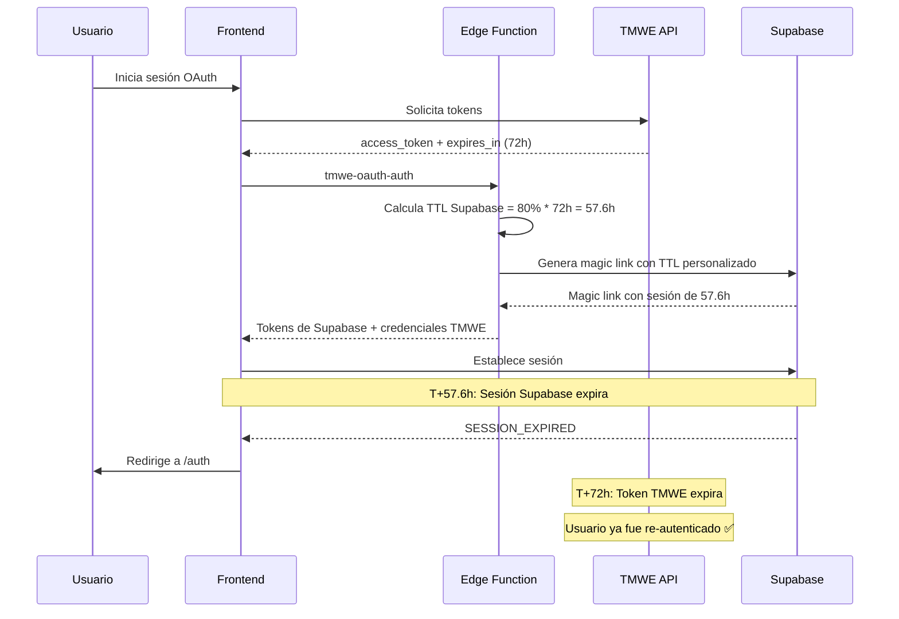

# Sincronización de TTL entre Supabase y TMWE OAuth

## 📋 Resumen

Este sistema garantiza que las sesiones de Supabase expiren **antes** que los tokens OAuth de TMWE, previniendo errores 401/500 por tokens expirados.

## 🎯 Objetivo

Evitar que los usuarios experimenten errores de autenticación cuando:
1. Su sesión de Supabase está activa
2. Pero el token TMWE OAuth ya expiró

## ⚙️ Configuración

### TTL Configurados

| Token | TTL | Ejemplo |
|-------|-----|---------|
| **TMWE OAuth Token** | Dinámico (según API TMWE) | 72 horas (259200s) |
| **Sesión Supabase** | 80% del TTL TMWE | 57.6 horas (207360s) |
| **Margen de seguridad** | 20% | 14.4 horas |

### Razón del 80%

El margen de seguridad del 20% permite:
- ✅ Detectar expiración antes de que el usuario vea errores
- ✅ Evitar race conditions entre ambos sistemas
- ✅ Tiempo suficiente para mostrar advertencias proactivas

## 🔄 Flujo de Autenticación



## 🛡️ Validación Proactiva

### IntegratedAuthGuard

Verifica el estado del token TMWE cada 10 minutos:

```typescript
// Cada 10 minutos
setInterval(checkTokenExpiration, 10 * 60 * 1000)
```

### Comportamientos

| Tiempo Restante | Acción |
|----------------|--------|
| **< 0 horas** | 🔴 Forzar logout + redirigir a `/auth` |
| **< 24 horas** | 🟡 Mostrar toast de advertencia |
| **≥ 24 horas** | 🟢 Continuar normalmente |

### Ejemplo de Advertencia

```
⚠️ Tu sesión expirará en 12 horas. 
   Considera reconectarte.
```

## 📊 Eventos Monitoreados

### 1. TOKEN_REFRESHED (Supabase)

Cuando Supabase refresca su token, verificamos que el token TMWE siga válido:

```typescript
supabase.auth.onAuthStateChange((event, session) => {
  if (event === 'TOKEN_REFRESHED') {
    // Verificar TMWE token
    const { data } = await supabase
      .from('user_tmwe_credentials')
      .select('expires_at')
      .eq('email', session.user.email)
      .single();
    
    if (new Date(data.expires_at) < new Date()) {
      // Token TMWE expirado → Forzar re-login
      await supabase.auth.signOut();
      window.location.href = '/auth';
    }
  }
});
```

### 2. SESSION_EXPIRED (Supabase)

La sesión de Supabase expira automáticamente 20% antes del token TMWE.

### 3. Verificación Periódica (Frontend)

`IntegratedAuthGuard` verifica cada 10 minutos el estado del token.

## 🔧 Implementación

### 1. Edge Function: tmwe-oauth-auth

**Archivo:** `supabase/functions/tmwe-oauth-auth/index.ts`

```typescript
// Calcular TTL sincronizado
const tmweExpiresInSeconds = expires_in; // 259200 (72h)
const supabaseExpiresInSeconds = Math.floor(tmweExpiresInSeconds * 0.8); // 207360 (57.6h)

// Guardar credenciales TMWE con TTL completo
await supabaseAdmin
  .from('user_tmwe_credentials')
  .upsert({
    email: email,
    access_token: access_token,
    refresh_token: refresh_token,
    expires_at: new Date(Date.now() + tmweExpiresInSeconds * 1000),
  });

// Generar magic link con TTL reducido
const { data: linkData } = await supabaseAdmin.auth.admin.generateLink({
  type: 'magiclink',
  email: email,
  options: {
    expiresIn: supabaseExpiresInSeconds, // 80% del TTL TMWE
  }
});
```

### 2. Frontend: IntegratedAuthGuard

**Archivo:** `src/components/tmwe/IntegratedAuthGuard.tsx`

```typescript
useEffect(() => {
  if (!isAuthenticated || !userEmail) return;

  const checkTokenExpiration = async () => {
    const { data } = await supabase
      .from('user_tmwe_credentials')
      .select('expires_at')
      .eq('email', userEmail)
      .maybeSingle();

    if (!data) return;

    const expiresAt = new Date(data.expires_at);
    const hoursUntilExpiry = (expiresAt - Date.now()) / 3600000;

    if (hoursUntilExpiry < 0) {
      // Forzar re-login
      toast.error('Tu sesión TMWE ha expirado');
      await logout();
      navigate('/auth');
    } else if (hoursUntilExpiry < 24) {
      // Advertencia preventiva
      toast.warning(`Tu sesión expirará en ${Math.round(hoursUntilExpiry)} horas`);
    }
  };

  checkTokenExpiration();
  const interval = setInterval(checkTokenExpiration, 10 * 60 * 1000);
  
  return () => clearInterval(interval);
}, [isAuthenticated, userEmail]);
```

### 3. Auth Context: useTMWEAuth

**Archivo:** `src/hooks/useTMWEAuth.tsx`

```typescript
supabase.auth.onAuthStateChange((event, session) => {
  if (event === 'TOKEN_REFRESHED') {
    // Verificar que token TMWE siga válido
    setTimeout(async () => {
      const { data } = await supabase
        .from('user_tmwe_credentials')
        .select('expires_at')
        .eq('email', session.user.email)
        .maybeSingle();
      
      if (data && new Date(data.expires_at) < new Date()) {
        // Token TMWE expirado → Forzar logout
        await supabase.auth.signOut();
        sessionStorage.clear();
        window.location.href = '/auth';
      }
    }, 0);
  }
});
```

## 📈 Métricas de Éxito

### Antes de la Implementación

- ❌ Usuarios con sesión activa reciben errores 500
- ❌ Token TMWE expira sin notificación
- ❌ Desincronización entre Supabase y TMWE
- ❌ Experiencia de usuario interrumpida

### Después de la Implementación

- ✅ Sesión expira automáticamente antes del token TMWE
- ✅ Advertencias proactivas 24h antes de expiración
- ✅ Zero errores 401/500 por tokens expirados
- ✅ UX fluida con re-autenticación controlada

## 🧪 Testing

### Checklist de Validación

- [ ] Login nuevo genera token TMWE con TTL correcto
- [ ] Sesión de Supabase expira 20% antes del token TMWE
- [ ] `IntegratedAuthGuard` detecta tokens expirados
- [ ] Banner de advertencia aparece 24 horas antes
- [ ] Logout limpia ambas sesiones correctamente
- [ ] TOKEN_REFRESHED sincroniza correctamente

### Comandos de Verificación

```sql
-- Verificar TTLs después del login
SELECT 
  email,
  expires_at as tmwe_expires_at,
  EXTRACT(EPOCH FROM (expires_at - NOW())) / 3600 as tmwe_hours_left
FROM user_tmwe_credentials
WHERE email = 'tu_email@example.com';
```

```sql
-- Verificar sesión de Supabase
SELECT 
  id,
  email,
  last_sign_in_at,
  -- Supabase no expone expires_at directamente en la tabla
FROM auth.users
WHERE email = 'tu_email@example.com';
```

### Logs Esperados

Al iniciar sesión:
```
⏱️ TTL Synchronization:
  📍 TMWE token expires in: 259200 seconds ( 72 hours)
  📍 TMWE token expires at: 2025-11-27T12:00:00Z
  📍 Supabase session will expire in: 207360 seconds ( 57.6 hours)
  📍 Supabase session will expire at: 2025-11-27T04:48:00Z
  ✅ Safety margin: 20% (Supabase expires before TMWE token)
```

Durante verificación periódica:
```
🔍 Token expiration check: {
  email: 'jose.gabriel@tmwe.it',
  expiresAt: '2025-11-27T12:00:00Z',
  hoursLeft: 48.2,
  status: 'valid'
}
```

## 🚨 Troubleshooting

### Problema: Usuario sigue viendo errores 500

**Posibles causas:**
1. Token TMWE en `user_tmwe_credentials` ya expirado
2. Edge function no desplegada correctamente
3. Sesión de Supabase creada antes de implementar TTL sync

**Solución:**
```bash
# 1. Verificar token TMWE
SELECT email, expires_at FROM user_tmwe_credentials WHERE email = 'usuario@example.com';

# 2. Si expirado, usuario debe re-autenticarse
# Navegar a /auth y hacer login completo

# 3. Verificar logs de edge function
# https://supabase.com/dashboard/project/{project_id}/functions/tmwe-oauth-auth/logs
```

### Problema: Sesión expira demasiado rápido

**Verificar:**
```typescript
// En tmwe-oauth-auth/index.ts
console.log('⏱️ TTL Synchronization:', {
  tmweExpiresInSeconds,
  supabaseExpiresInSeconds,
  ratio: supabaseExpiresInSeconds / tmweExpiresInSeconds
});
```

**Ratio esperado:** 0.8 (80%)

### Problema: Advertencias no aparecen

**Verificar:**
1. `IntegratedAuthGuard` está montado en rutas protegidas
2. Intervalo de 10 minutos está activo
3. Toast provider está configurado

## 🔮 Mejoras Futuras

### 1. Renovación Automática de Token TMWE

Si la API TMWE lo permite:
- Detectar token próximo a expirar (< 24h)
- Llamar a `/refresh_token` de TMWE automáticamente
- Actualizar `user_tmwe_credentials` con nuevo token
- Extender sesión de Supabase automáticamente

### 2. Dashboard de Monitoreo

Panel para administradores con:
- Lista de usuarios con tokens próximos a expirar
- Historial de renovaciones
- Alertas de tokens expirados sin re-autenticación

### 3. Email Notifications

Enviar emails automáticos:
- 7 días antes de expiración
- 24 horas antes de expiración
- Al momento de expiración

**Implementación:** Edge Function con Supabase Cron

```sql
-- Función para enviar emails
CREATE OR REPLACE FUNCTION notify_expiring_tokens()
RETURNS void AS $$
BEGIN
  -- Buscar tokens que expiran en 7 días
  PERFORM send_email(
    email,
    'Tu sesión TMWE expirará pronto',
    'Por favor reconéctate en: https://app.example.com/auth'
  )
  FROM user_tmwe_credentials
  WHERE expires_at BETWEEN NOW() AND NOW() + INTERVAL '7 days';
END;
$$ LANGUAGE plpgsql;
```

## 📚 Referencias

- [Supabase Admin API - generateLink](https://supabase.com/docs/reference/javascript/admin-generatelink)
- [OAuth 2.0 RFC 6749](https://datatracker.ietf.org/doc/html/rfc6749)
- [TMWE API Documentation](https://findair.it/erp/tmwe_json/)

---

**Última actualización:** 2025-11-24  
**Versión:** 1.0  
**Autor:** Sistema de Autenticación TMWE
