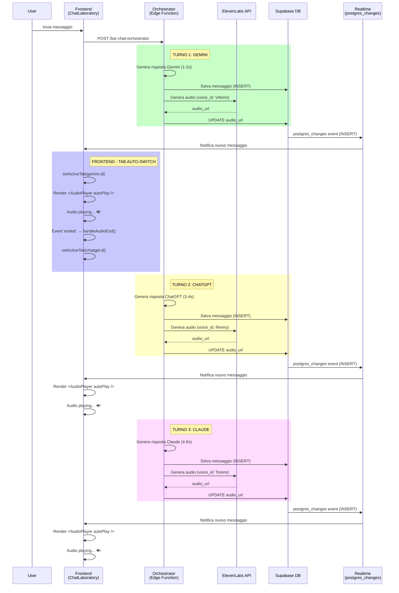
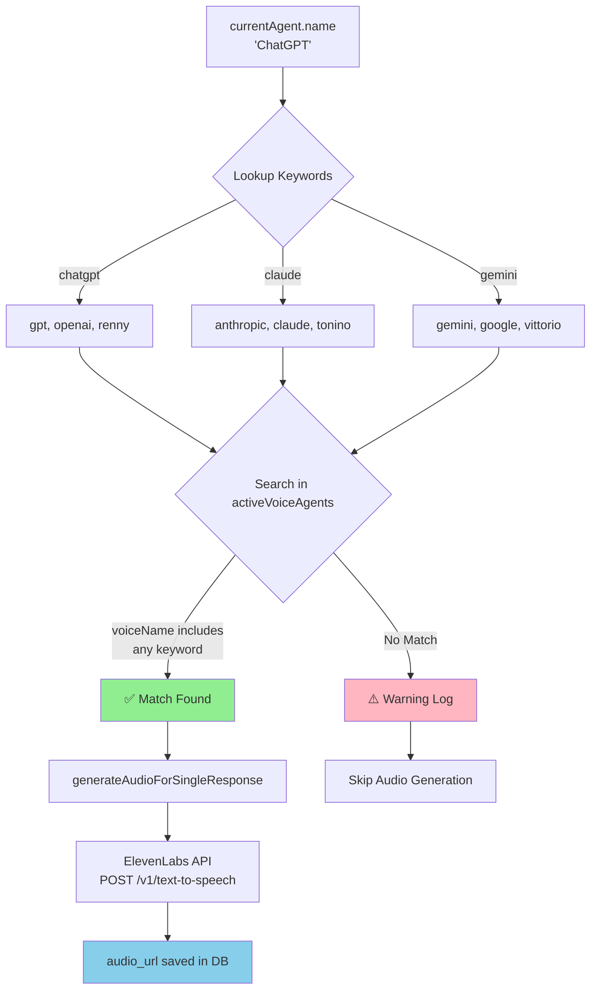
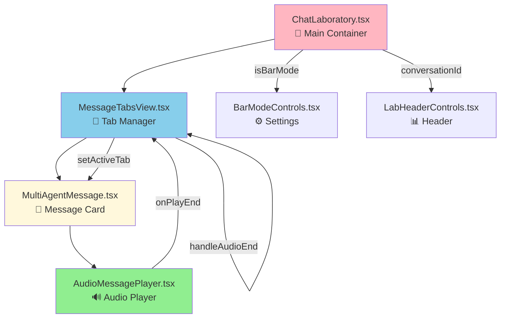
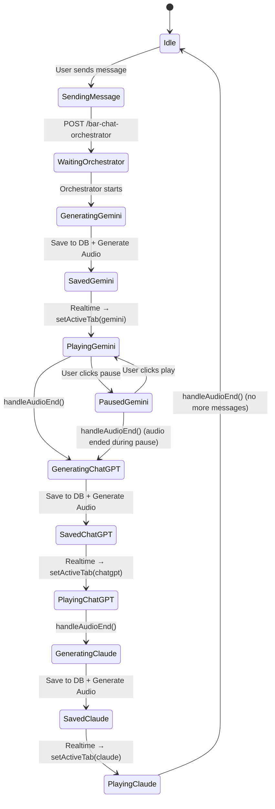
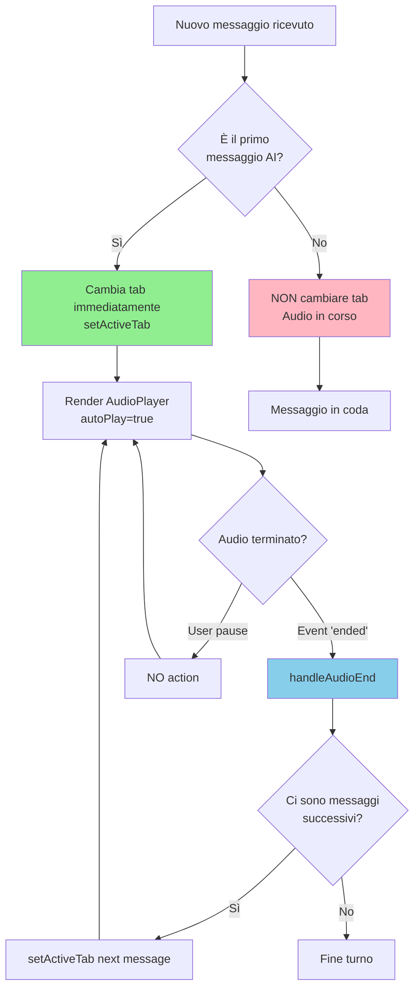
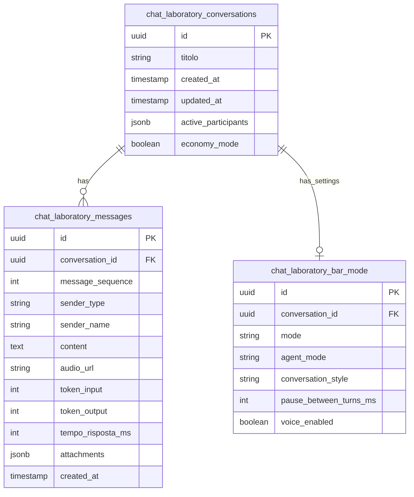
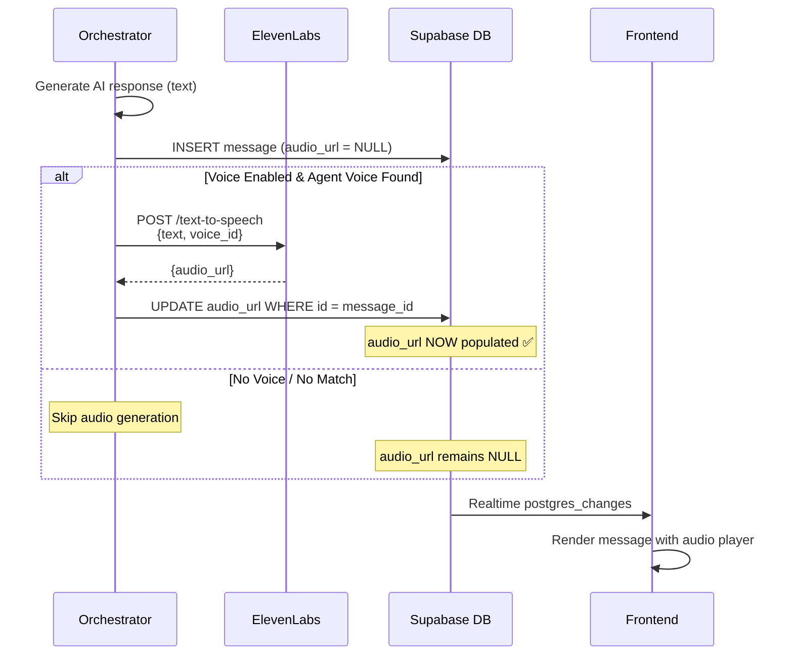
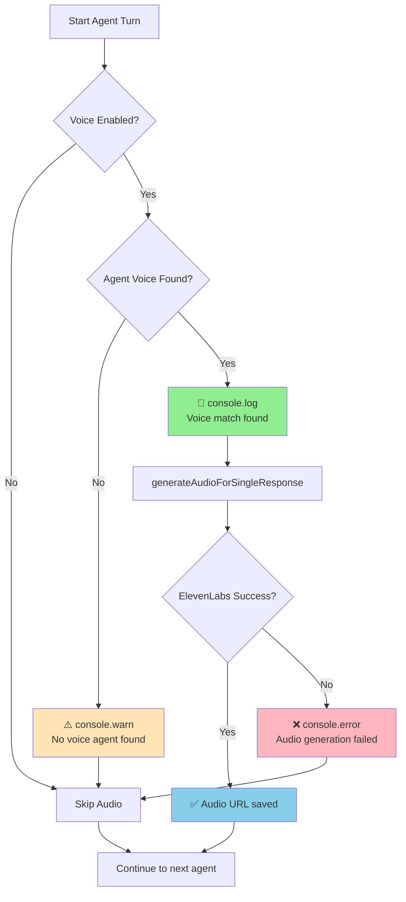

# 🏗️ Architettura Sistema Audio Multi-Agente

---

## Flusso Completo: User Message → Audio Playback



---

## Voice Agent Matching Flow



**Esempio Concreto:**

```typescript
currentAgent = { name: 'ChatGPT', type: 'openai' }
activeVoiceAgents = [
  { name: 'Renny - GPT', voice_id: '11szj1LU...' },
  { name: 'Tonino - Anthropic', voice_id: 'Ak3m7Npq...' },
  { name: 'Vittorio - Gemini', voice_id: 'KOtk7Uqu...' }
]

// Step 1: Lookup keywords
agentKey = 'chatgpt'
searchKeywords = ['gpt', 'openai', 'renny']

// Step 2: Search in activeVoiceAgents
voiceName = 'renny - gpt' // lowercase
searchKeywords.some(kw => voiceName.includes(kw))
// 'gpt' is included → Match ✅

// Result:
agentVoice = { name: 'Renny - GPT', voice_id: '11szj1LU...' }
```

---

## Component Hierarchy (Frontend)



---

## State Management Flow



---

## Audio Auto-Follow Logic



---

## Database Schema (Relevanti)



---

## Critical Data Flow: `audio_url` Population



---

## Performance Optimization: Sequential vs Parallel

**Attuale (Sequential):** ✅ WORKING

```
Gemini (2s) → Audio (0.5s) → ChatGPT (4s) → Audio (0.5s) → Claude (6s) → Audio (0.5s)
Total Time: ~13.5s
```

**Alternativa (Parallel):** ⚠️ NON IMPLEMENTATO

```
Gemini (2s) ┐
ChatGPT (4s) ├─ All parallel → Max(2s, 4s, 6s) = 6s + Audio (0.5s each)
Claude (6s) ┘
Total Time: ~6.5s (ma ordine imprevedibile)
```

**Motivo scelta Sequential:**
- Ordine deterministico (Gemini → ChatGPT → Claude)
- Audio playback sequenziale naturale
- Debugging più semplice
- Context building progressivo (ogni agente vede risposte precedenti)

---

## Error Handling & Logging



---

## Key Decisions & Trade-offs

| Decision | Pro | Con | Chosen |
|----------|-----|-----|--------|
| **Sequential Calls** | Deterministic order, progressive context | Slower total time | ✅ Yes |
| **Keyword Matching** | Flexible, robust | Requires maintenance if names change | ✅ Yes |
| **Immediate Audio Gen** | Low latency for user | Blocks orchestrator briefly | ✅ Yes |
| **autoPlay={true}** | Seamless UX | Browser permissions needed | ✅ Yes |
| **Tab Auto-Switch** | Follows conversation flow | Can be disruptive if disabled | ✅ Yes (with toggle) |

---

## File Structure

```
supabase/functions/bar-chat-orchestrator/
├── index.ts                    // Main orchestrator (500 lines)
├── lib/
│   ├── utils.ts               // Delay, token estimation
│   ├── config-loader.ts       // Load configs from DB
│   ├── prompt-builder.ts      // Build system prompts
│   ├── ai-providers.ts        // Claude, ChatGPT, Gemini calls
│   └── audio-generator.ts     // ElevenLabs integration

src/components/chat-laboratory/
├── MessageTabsView.tsx         // Tab manager + auto-follow (295 lines)
├── MultiAgentMessage.tsx       // Message card + audio player (341 lines)
├── AudioMessagePlayer.tsx      // Audio controls (148 lines)
└── BarModeControls.tsx         // Settings panel

src/pages/
└── ChatLaboratory.tsx          // Main page (1640 lines)
```

---

**📘 Per maggiori dettagli implementativi, vedi i file di backup.**
