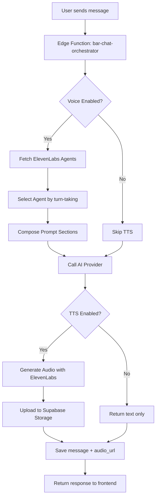

# 💾 Database Backup - Pre Bar Mode Simultaneous Fix

**Data Backup:** 2025-01-20  
**Motivo:** Salvataggio stato completo sistema Bar Mode funzionante (TTS + Full-Duplex) prima fix risposta simultanea agenti  
**Versione Sistema:** v3.0 - TTS Funzionante  

---

## 🎯 Stato Sistema al Backup

### ✅ Funzionalità Operative
- [x] Bar Mode attivo e funzionante
- [x] TTS ElevenLabs integrato e testato
- [x] Full-Duplex Recorder con trascrizione
- [x] Storage audio in Supabase
- [x] Prompt Sections dinamiche (BASE, TOPIC, AGENT_PERSONALITY)
- [x] Knowledge Base integration
- [x] Voice controls completi
- [x] Interrupt button funzionante

### ⚠️ Issue Nota
- **Problema:** Agenti rispondono **tutti simultaneamente** invece che a turno
- **Impatto:** Audio sovrapposti, esperienza utente confusa
- **Da Risolvere:** Prossimo intervento sequenziale response

---

## 📊 Schema Tabelle Chat Laboratory

### 1. `chat_laboratory_bar_mode`

**Scopo:** Configurazione modalità Bar per ogni conversazione

```sql
CREATE TABLE chat_laboratory_bar_mode (
  id UUID PRIMARY KEY DEFAULT gen_random_uuid(),
  conversation_id UUID NOT NULL UNIQUE REFERENCES chat_laboratory_conversations(id),
  user_id UUID REFERENCES auth.users(id),
  
  -- Knowledge Base Navigation
  active_kb_id UUID,
  kb_navigation_history JSONB DEFAULT '[]'::jsonb,
  
  -- Voice Settings
  voice_enabled BOOLEAN NOT NULL DEFAULT false,
  auto_play_audio BOOLEAN NOT NULL DEFAULT true,
  enable_interruptions BOOLEAN NOT NULL DEFAULT true,
  continuous_mic_enabled BOOLEAN DEFAULT false,
  interrupt_requested BOOLEAN DEFAULT false,
  
  -- Topic Selection
  selected_topic TEXT,
  
  -- Conversation Settings
  conversation_pace TEXT NOT NULL DEFAULT 'normal',
  mode TEXT NOT NULL DEFAULT 'laboratory',
  
  created_at TIMESTAMPTZ NOT NULL DEFAULT now(),
  updated_at TIMESTAMPTZ NOT NULL DEFAULT now()
);
```

**Constraint:** `UNIQUE (conversation_id)` per evitare duplicati

**Indici:**
- `idx_bar_mode_conversation_id` su `conversation_id`
- `idx_bar_mode_user_id` su `user_id`

---

### 2. `chat_laboratory_audio_responses`

**Scopo:** Tracking risposte audio generate da ElevenLabs TTS

```sql
CREATE TABLE chat_laboratory_audio_responses (
  id UUID PRIMARY KEY DEFAULT gen_random_uuid(),
  message_id UUID NOT NULL REFERENCES chat_laboratory_messages(id) ON DELETE CASCADE,
  agent_id UUID NOT NULL,
  audio_url TEXT NOT NULL,
  text_length INTEGER,
  duration_seconds DOUBLE PRECISION,
  created_at TIMESTAMPTZ NOT NULL DEFAULT now()
);
```

**Indici:**
- `idx_audio_responses_message_id` su `message_id`
- `idx_audio_responses_agent_id` su `agent_id`

---

### 3. `chat_laboratory_prompt_sections`

**Scopo:** Gestione dinamica sezioni prompt (BASE, TOPIC, AGENT_PERSONALITY)

```sql
CREATE TABLE chat_laboratory_prompt_sections (
  id UUID PRIMARY KEY DEFAULT gen_random_uuid(),
  section_name TEXT NOT NULL,
  section_type TEXT NOT NULL, -- 'BASE', 'TOPIC', 'AGENT_PERSONALITY'
  content TEXT NOT NULL,
  topic_tags TEXT[] DEFAULT '{}',
  is_active BOOLEAN DEFAULT true,
  order_priority INTEGER DEFAULT 0,
  created_at TIMESTAMPTZ DEFAULT now(),
  updated_at TIMESTAMPTZ DEFAULT now()
);
```

**Check Constraint:**
```sql
CHECK (section_type IN ('BASE', 'TOPIC', 'AGENT_PERSONALITY'))
```

**Indici:**
- `idx_prompt_sections_type` su `section_type`
- `idx_prompt_sections_active` su `is_active`
- `idx_prompt_sections_priority` su `order_priority`

---

### 4. `elevenlabs_agents`

**Scopo:** Configurazione agenti vocali ElevenLabs

```sql
CREATE TABLE elevenlabs_agents (
  id UUID PRIMARY KEY DEFAULT gen_random_uuid(),
  user_id UUID REFERENCES auth.users(id),
  elevenlabs_agent_id TEXT NOT NULL,
  name TEXT NOT NULL,
  voice_id TEXT NOT NULL,
  text_generation_prompt TEXT NOT NULL,
  is_active BOOLEAN NOT NULL DEFAULT true,
  
  -- Voice Settings
  speaking_pace TEXT NOT NULL DEFAULT 'normal',
  interruption_style TEXT NOT NULL DEFAULT 'polite',
  response_style TEXT NOT NULL DEFAULT 'bar_chat',
  max_words_per_response INTEGER NOT NULL DEFAULT 50,
  order_index INTEGER NOT NULL DEFAULT 0,
  
  created_at TIMESTAMPTZ NOT NULL DEFAULT now(),
  updated_at TIMESTAMPTZ NOT NULL DEFAULT now()
);
```

**Indici:**
- `idx_elevenlabs_agents_user_id` su `user_id`
- `idx_elevenlabs_agents_active` su `is_active`
- `idx_elevenlabs_agents_order` su `order_index`

---

### 5. `voice_agent_config`

**Scopo:** Configurazione globale ElevenLabs API

```sql
CREATE TABLE voice_agent_config (
  id UUID PRIMARY KEY DEFAULT gen_random_uuid(),
  elevenlabs_api_key TEXT,
  enabled BOOLEAN NOT NULL DEFAULT false,
  created_at TIMESTAMPTZ NOT NULL DEFAULT now(),
  updated_at TIMESTAMPTZ NOT NULL DEFAULT now()
);
```

**Nota Sicurezza:** API key criptata tramite RLS

---

## 🔐 RLS Policies Attive

### `chat_laboratory_bar_mode`

```sql
-- Users can manage their own bar mode settings
CREATE POLICY "Users can manage their own bar mode settings"
ON chat_laboratory_bar_mode
FOR ALL
USING (auth.uid() = user_id);

-- Users can view their own bar mode settings
CREATE POLICY "Users can view their own bar mode settings"
ON chat_laboratory_bar_mode
FOR SELECT
USING (auth.uid() = user_id);
```

### `chat_laboratory_audio_responses`

```sql
-- System can insert audio responses
CREATE POLICY "System can insert audio responses"
ON chat_laboratory_audio_responses
FOR INSERT
WITH CHECK (true);

-- Users can view audio responses for their conversations
CREATE POLICY "Users can view audio responses for their conversations"
ON chat_laboratory_audio_responses
FOR SELECT
USING (
  EXISTS (
    SELECT 1 FROM chat_laboratory_messages m
    JOIN chat_laboratory_bar_mode bm ON m.conversation_id = bm.conversation_id
    WHERE m.id = message_id AND bm.user_id = auth.uid()
  )
);
```

### `chat_laboratory_prompt_sections`

```sql
-- Anyone can view prompt sections
CREATE POLICY "Anyone can view prompt sections"
ON chat_laboratory_prompt_sections
FOR SELECT
USING (true);

-- Admins can manage prompt sections
CREATE POLICY "Admins can manage prompt sections"
ON chat_laboratory_prompt_sections
FOR ALL
USING (is_admin(auth.uid()));
```

### `elevenlabs_agents`

```sql
-- Users can view their own agents
CREATE POLICY "Users can view their own agents"
ON elevenlabs_agents
FOR SELECT
USING (auth.uid() = user_id);

-- Users can insert their own agents
CREATE POLICY "Users can insert their own agents"
ON elevenlabs_agents
FOR INSERT
WITH CHECK (auth.uid() = user_id);

-- Users can update their own agents
CREATE POLICY "Users can update their own agents"
ON elevenlabs_agents
FOR UPDATE
USING (auth.uid() = user_id);

-- Users can delete their own agents
CREATE POLICY "Users can delete their own agents"
ON elevenlabs_agents
FOR DELETE
USING (auth.uid() = user_id);
```

---

## ⚙️ Database Functions

### 1. `update_chat_laboratory_updated_at()`

**Scopo:** Auto-update campo `updated_at` su modifiche tabelle

```sql
CREATE OR REPLACE FUNCTION update_chat_laboratory_updated_at()
RETURNS TRIGGER AS $$
BEGIN
  NEW.updated_at = now();
  RETURN NEW;
END;
$$ LANGUAGE plpgsql;
```

**Trigger Associati:**
- `chat_laboratory_bar_mode`
- `chat_laboratory_conversations`
- `elevenlabs_agents`
- `voice_agent_config`

---

## 📋 Trigger Attivi

```sql
-- Trigger su chat_laboratory_bar_mode
CREATE TRIGGER update_bar_mode_updated_at
  BEFORE UPDATE ON chat_laboratory_bar_mode
  FOR EACH ROW
  EXECUTE FUNCTION update_chat_laboratory_updated_at();

-- Trigger su elevenlabs_agents
CREATE TRIGGER update_elevenlabs_agents_updated_at
  BEFORE UPDATE ON elevenlabs_agents
  FOR EACH ROW
  EXECUTE FUNCTION update_chat_laboratory_updated_at();
```

---

## 🎨 Configurazione Sistema Attuale

### Prompt Sections Example

**BASE Section:**
```
IDENTITÀ:
Sei un esperto poliedrico con competenze trasversali in ingegneria, programmazione, medicina, sport e musica.

REGOLE DI RISPOSTA:
- Massimo 2-3 frasi
- Tono colloquiale tipo bar
- Niente liste puntate
```

**TOPIC Section (esempio: "calcio"):**
```
Topic: Calcio
Focus su: tattiche, giocatori, campionati, analisi partite
Stile: Da tifoso appassionato ma con analisi tecniche
```

**AGENT_PERSONALITY Section (esempio: "Renny"):**
```
Nome: Renny
Personalità: Pragmatico, diretto, ironico
Stile: Risposte brevi ma incisive, battute quando opportuno
```

---

## 📦 Storage Buckets

### `audio-responses`

**Path Structure:**
```
audio-responses/
└── bar-chat/
    └── {conversation_id}/
        ├── {timestamp1}.mp3
        ├── {timestamp2}.mp3
        └── ...
```

**Public Access:** ✅ Enabled  
**CORS:** Configurato per frontend

---

## 🔄 Flusso Completo Bar Mode



---

## 🚨 Issue Corrente

### Problema: Risposta Simultanea Agenti

**Comportamento Attuale:**
```javascript
// Tutti i partecipanti rispondono insieme
participants.forEach(p => {
  callAIProvider(p) // ❌ Tutte le chiamate parallele
})
```

**Comportamento Desiderato:**
```javascript
// Un partecipante alla volta
const selectedParticipant = participants[currentTurnIndex]
callAIProvider(selectedParticipant) // ✅ Una chiamata sola
```

**Root Cause:** Turn-taking logic non implementata correttamente in `bar-chat-orchestrator/index.ts`

---

## 📝 Test Coverage

### ✅ Test Superati
- [x] TTS generation con ElevenLabs
- [x] Upload audio Supabase Storage
- [x] Full-Duplex transcription
- [x] Prompt sections composition
- [x] Knowledge Base integration
- [x] Interrupt button functionality

### ⏳ Test da Eseguire Post-Fix
- [ ] Sequential agent response
- [ ] Turn-taking logic verification
- [ ] Audio playback timing
- [ ] No audio overlap

---

## 🔧 File Critici da NON Modificare

**Questi file sono PERFETTI e funzionanti:**

1. `src/components/chat-laboratory/BarFullDuplexRecorder.tsx`
2. `src/components/chat-laboratory/BarModeControls.tsx`
3. `src/components/chat-laboratory/BarVoiceRecorder.tsx`
4. `supabase/functions/bar-chat-orchestrator/index.ts` (versione corrente)

**Se necessario rollback:**
- Restore da `index-old-2025-01-20.ts`

---

## 📊 Dati Esempio

### Bar Mode Settings
```json
{
  "conversation_id": "c9df549e-cb9c-4e0b-a309-73aa8d1a448c",
  "user_id": "user-uuid",
  "voice_enabled": true,
  "auto_play_audio": true,
  "selected_topic": null,
  "mode": "bar",
  "conversation_pace": "normal"
}
```

### ElevenLabs Agent
```json
{
  "id": "9ca6967d-7a9e-4e9a-bfbf-a47411a4b93a",
  "name": "Renny - GPT",
  "voice_id": "11szj1LU6LbJrDi1KX7P",
  "elevenlabs_agent_id": "agent_123",
  "text_generation_prompt": "Sei Renny, esperto pragmatico...",
  "is_active": true,
  "order_index": 0
}
```

---

## 🎯 Restore Procedure

In caso di necessità ripristino completo:

1. **Database:**
   ```sql
   -- Schema già presente, nessuna modifica necessaria
   -- Verificare RLS policies attive
   ```

2. **Edge Function:**
   ```bash
   cp index-old-2025-01-20.ts index.ts
   # Rideploy automatico
   ```

3. **Frontend:**
   ```bash
   # Nessuna modifica necessaria
   # Componenti già funzionanti
   ```

4. **Verifica:**
   - Test Bar Mode conversation
   - Verifica TTS generation
   - Check audio storage
   - Test Full-Duplex transcription

---

**Backup Creato:** 2025-01-20 19:45 UTC  
**Sistema Salvato:** v3.0 - TTS Working  
**Prossimo Intervento:** Fix Sequential Agent Response  

**Autore:** AI Development Team  
**Review Required:** ✅ Prima di modifiche critiche
