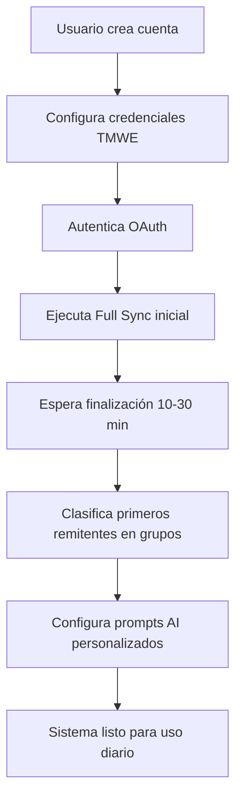
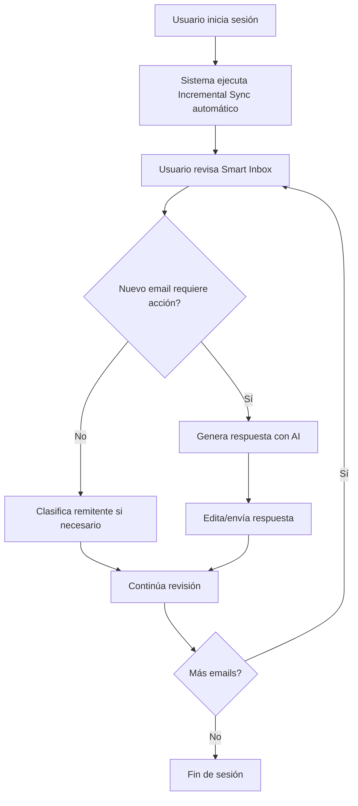
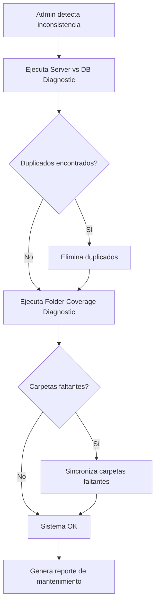

# FunnEmail - Documentación de Casos de Uso

**Versión:** 1.0  
**Fecha:** 2025-01-29  
**Autor:** TMWEngine Development Team

---

## 📋 Índice

1. [Visión General del Sistema](#visión-general-del-sistema)
2. [Actores del Sistema](#actores-del-sistema)
3. [Módulos Funcionales](#módulos-funcionales)
4. [Casos de Uso Detallados](#casos-de-uso-detallados)
5. [Flujos de Trabajo Principales](#flujos-de-trabajo-principales)
6. [Requisitos Técnicos](#requisitos-técnicos)
7. [Métricas de Uso](#métricas-de-uso)
8. [Roadmap](#roadmap)
9. [Glosario](#glosario)

---

## 1. Visión General del Sistema

### 1.1 Propósito
FunnEmail es un sistema de gestión inteligente de correos electrónicos que combina:
- **Organización visual** mediante drag & drop
- **Inteligencia artificial** para categorización, respuestas y automatización
- **Sincronización robusta** con servidores de correo externos (IMAP/SMTP)
- **Análisis avanzado** de integridad y diagnóstico

### 1.2 Arquitectura Tecnológica
- **Frontend:** React 18 + TypeScript + Tailwind CSS
- **Backend:** Supabase (PostgreSQL + Edge Functions)
- **AI:** OpenAI GPT-4, Gemini 2.0 Flash
- **API Externa:** TMWE API (IMAP/SMTP Integration)
- **Sincronización:** Edge Functions con estrategias múltiples

### 1.3 Usuarios Objetivo
- **Profesionales** con alto volumen de emails (>100 diarios)
- **Equipos comerciales** que necesitan clasificación rápida de leads
- **Administradores** que gestionan cuentas compartidas
- **Usuarios avanzados** que requieren automatización personalizada

---

## 2. Actores del Sistema

### 2.1 Usuario Final (End-User)
**Descripción:** Persona que utiliza FunnEmail para gestionar su correo electrónico.

**Responsabilidades:**
- Clasificar remitentes en grupos visuales
- Configurar prompts de AI personalizados
- Ejecutar sincronizaciones de correo
- Revisar sugerencias de AI
- Gestionar cuentas compartidas

**Permisos:**
- Acceso completo a sus datos de correo
- Lectura/escritura en sus configuraciones de AI
- Ejecución de sincronizaciones

### 2.2 Administrador del Sistema (System Admin)
**Descripción:** Usuario con privilegios elevados para configuración global.

**Responsabilidades:**
- Configurar credenciales de TMWE API
- Gestionar modelos de AI disponibles
- Monitorear métricas de rendimiento
- Resolver problemas de integridad de datos

**Permisos:**
- Acceso a `config_ai` table
- Ejecución de diagnósticos avanzados
- Visualización de logs de Edge Functions

### 2.3 Sistema AI (AI System)
**Descripción:** Componente automatizado que ejecuta tareas de inteligencia artificial.

**Responsabilidades:**
- Procesar solicitudes de categorización
- Generar respuestas contextuales
- Crear sugerencias de agrupación
- Analizar metadatos de correos

**Interacciones:**
- Consume datos de `email_messages`, `email_senders`, `email_sender_groups`
- Escribe en `ai_categorization_suggestions`, `ai_cost_tracking`
- Invocado por Edge Functions (`tmwe-ai-email-assistant`, `ai-sender-categorization`)

---

## 3. Módulos Funcionales

### 3.1 Email Management (Gestión Visual de Remitentes)
**Descripción:** Interfaz drag & drop para organizar remitentes en grupos visuales.

**Características:**
- Grupos predefinidos: `clients`, `suppliers`, `partners`, `spam`, `archive`
- Creación de grupos personalizados con colores e íconos
- Arrastrar remitentes entre grupos
- Ver historial de emails por remitente
- Asociar múltiples cuentas de correo a un remitente

**Pantallas Principales:**
- `/funnemail` - Vista principal con columnas de grupos
- `/email-senders` - Gestión avanzada de remitentes

### 3.2 Smart Inbox (Bandeja Inteligente)
**Descripción:** Visualización y análisis inteligente de correos con AI.

**Características:**
- Clasificación automática de correos
- Extracción de metadatos (sender, subject, date, urgency)
- Respuestas contextuales generadas por AI
- Filtros avanzados (fecha, remitente, carpeta)
- Búsqueda full-text

**Pantallas Principales:**
- `/smart-inbox` - Vista principal de correos
- Panel lateral con detalles de email seleccionado

### 3.3 AI Automation (Automatización por Remitente)
**Descripción:** Sistema de prompts personalizados por remitente para automatizar respuestas y acciones.

**Características:**
- Creación de prompts personalizados por remitente
- Templates predefinidos (respuesta profesional, análisis técnico, etc.)
- Test de prompts antes de aplicar
- Historial de respuestas generadas
- Configuración de temperatura y max_tokens

**Pantallas Principales:**
- Panel en `/funnemail` al hacer clic en un remitente
- Editor de prompts con preview en tiempo real

### 3.4 Email Sync (Sincronización de Correo)
**Descripción:** Sistema robusto de sincronización con múltiples estrategias.

**Estrategias Disponibles:**
1. **Incremental:** Sincroniza solo nuevos emails desde última ejecución
2. **Full:** Sincroniza todos los emails de todas las carpetas
3. **Luca:** Estrategia experimental con validación avanzada
4. **Clean:** Sincronización segura con validación de datos

**Características:**
- Logs en tiempo real con detalles de progreso
- Gestión de errores con reintentos automáticos
- Detección de duplicados
- Cálculo de costos de API
- Progreso visual (folders procesadas, emails descargados)

**Edge Functions:**
- `tmwe-email-sync-master` - Orquestador principal
- `tmwe-api-proxy` - Proxy para llamadas a TMWE API

**Pantallas Principales:**
- `/singlefast` - Quick Download con UI simplificada
- `/sync-email` - Panel completo de sincronización

### 3.5 AI Grouping Suggestions (Sugerencias de Agrupación)
**Descripción:** Sistema de recomendaciones de AI para clasificar remitentes.

**Características:**
- Análisis batch de remitentes sin grupo
- Sugerencias con nivel de confianza (0-100%)
- Justificación detallada del razonamiento de AI
- Aceptación/rechazo masivo de sugerencias
- Tracking de costos por sugerencia

**Flujo de Trabajo:**
1. Usuario ejecuta análisis de remitentes sin clasificar
2. AI analiza emails históricos y genera sugerencias
3. Usuario revisa sugerencias en interfaz dedicada
4. Acepta/rechaza cada sugerencia
5. Sistema actualiza `email_senders` table automáticamente

**Pantallas Principales:**
- `/ai-grouping-suggestions` - Revisión de sugerencias

### 3.6 Shared Email Accounts (Cuentas Compartidas)
**Descripción:** Gestión de buzones de correo compartidos entre múltiples usuarios.

**Características:**
- Asignación de permisos por usuario (read, write, admin)
- Sincronización compartida de emails
- Respuestas colaborativas con AI
- Historial de acciones por usuario

**Pantallas Principales:**
- `/shared-accounts` - Gestión de cuentas compartidas

### 3.7 Email Integrity & Diagnostics (Integridad y Diagnóstico)
**Descripción:** Herramientas para verificar consistencia de datos y rendimiento.

**Características:**
- Comparación servidor vs base de datos
- Detección de duplicados (message_id, hash)
- Análisis de carpetas faltantes
- Estadísticas de rendimiento de Edge Functions
- Reporte de costos de API

**Diagnósticos Disponibles:**
- **Server vs DB Comparison:** Detecta emails en servidor no presentes en DB
- **Duplicate Detection:** Encuentra duplicados por message_id o content_hash
- **Folder Coverage:** Identifica carpetas no sincronizadas
- **Performance Stats:** Tiempos de respuesta, throughput, error rates

**Pantallas Principales:**
- `/email-diagnostic` - Panel de diagnóstico completo

### 3.8 AI Communication Hub (Hub de Comunicación AI)
**Descripción:** Badge flotante para selección de agente AI en toda la aplicación.

**Características:**
- Selector de agente AI activo (GPT-4, Gemini 2.0, etc.)
- Persistencia de selección por ruta de página
- Integración con todos los módulos AI
- Indicador visual de agente activo

**Ubicación:** Badge flotante en esquina inferior derecha

---

## 4. Casos de Uso Detallados

### CU-01: Clasificar Remitente Visualmente

**Actor Principal:** Usuario Final

**Precondiciones:**
- Usuario autenticado
- Al menos un email sincronizado en la base de datos

**Flujo Principal:**
1. Usuario navega a `/funnemail`
2. Sistema muestra columnas de grupos con remitentes
3. Usuario arrastra remitente desde columna origen (ej: "Inbox")
4. Usuario suelta remitente en columna destino (ej: "Clients")
5. Sistema actualiza `email_senders.group_type`
6. Sistema muestra toast de confirmación

**Flujos Alternativos:**
- **FA-01:** Usuario crea nuevo grupo personalizado
  - Usuario hace clic en "Nuevo Grupo"
  - Ingresa nombre, color, icono
  - Sistema crea grupo en `email_sender_groups`
  - Usuario arrastra remitente al nuevo grupo

**Postcondiciones:**
- Remitente asignado al grupo correcto
- Emails del remitente visibles en Smart Inbox con etiqueta de grupo

**Prioridad:** Alta  
**Frecuencia de Uso:** Diaria  
**Complejidad:** Baja

---

### CU-02: Sincronizar Emails (Incremental)

**Actor Principal:** Usuario Final

**Precondiciones:**
- Credenciales TMWE configuradas en `config_ai`
- Token OAuth válido

**Flujo Principal:**
1. Usuario navega a `/singlefast`
2. Usuario hace clic en "Quick Download (Incremental)"
3. Sistema invoca Edge Function `tmwe-email-sync-master` con parámetro `strategy: "incremental"`
4. Edge Function:
   - Consulta `email_sync_progress` para encontrar última fecha de sincronización
   - Llama a TMWE API con filtro `received_after: last_sync_date`
   - Descarga solo emails nuevos
   - Inserta en `email_messages` table
5. Sistema muestra logs en tiempo real
6. Sistema muestra toast de finalización con estadísticas

**Flujos Alternativos:**
- **FA-01:** Token expirado
  - Sistema detecta error 401 de TMWE API
  - Sistema muestra modal de re-autenticación
  - Usuario re-autentica con OAuth
  - Sistema reinicia sincronización

- **FA-02:** Error de red durante sincronización
  - Edge Function detecta timeout o error de conexión
  - Sistema muestra error en logs
  - Usuario puede reintentar sincronización

**Postcondiciones:**
- Nuevos emails insertados en `email_messages`
- `email_sync_progress.last_sync_date` actualizado
- Logs de sincronización guardados en `email_sync_logs`

**Prioridad:** Crítica  
**Frecuencia de Uso:** Cada 30 minutos (automática) o manual  
**Complejidad:** Media

---

### CU-03: Generar Respuesta con AI

**Actor Principal:** Usuario Final  
**Actor Secundario:** Sistema AI

**Precondiciones:**
- Email seleccionado en Smart Inbox
- Modelo AI configurado y con créditos disponibles

**Flujo Principal:**
1. Usuario selecciona email en `/smart-inbox`
2. Usuario hace clic en botón "Generate AI Response"
3. Sistema recopila contexto:
   - Contenido del email
   - Historial de conversación con remitente
   - Prompt personalizado del remitente (si existe)
4. Sistema invoca Edge Function `tmwe-ai-email-assistant`
5. Edge Function:
   - Construye prompt con contexto completo
   - Llama a OpenAI/Gemini API
   - Registra tokens y costos en `ai_cost_tracking`
6. Sistema muestra respuesta generada en panel lateral
7. Usuario puede:
   - Editar respuesta
   - Copiar al portapapeles
   - Enviar directamente (futuro)

**Flujos Alternativos:**
- **FA-01:** Prompt personalizado existe para remitente
  - Sistema usa prompt específico en lugar de prompt genérico
  - Sistema aplica temperatura y max_tokens configurados

- **FA-02:** Error de API (rate limit, cuota excedida)
  - Sistema muestra error detallado
  - Sistema sugiere modelo alternativo

**Postcondiciones:**
- Respuesta generada visible para usuario
- Costos registrados en `ai_cost_tracking`
- Historial de respuesta guardado (opcional)

**Prioridad:** Alta  
**Frecuencia de Uso:** 10-20 veces/día  
**Complejidad:** Media

---

### CU-04: Crear Prompt Personalizado por Remitente

**Actor Principal:** Usuario Final

**Precondiciones:**
- Remitente seleccionado en `/funnemail`
- Usuario con permisos de escritura

**Flujo Principal:**
1. Usuario selecciona remitente en columna de grupo
2. Usuario hace clic en "Configure AI Prompt"
3. Sistema abre modal con editor de prompt
4. Usuario:
   - Selecciona template predefinido o escribe desde cero
   - Configura temperatura (0.0 - 1.0)
   - Configura max_tokens (100 - 4000)
   - Ingresa ejemplos de respuestas esperadas
5. Usuario hace clic en "Test Prompt"
6. Sistema ejecuta test con email de ejemplo del remitente
7. Usuario revisa resultado de test
8. Usuario guarda prompt
9. Sistema inserta en `ai_prompt_library` con link a `email_senders.id`

**Flujos Alternativos:**
- **FA-01:** Test de prompt falla
  - Sistema muestra error detallado
  - Usuario ajusta prompt
  - Usuario vuelve a testar

**Postcondiciones:**
- Prompt guardado y asociado al remitente
- Futuras respuestas AI usan prompt personalizado

**Prioridad:** Media  
**Frecuencia de Uso:** 1-2 veces/semana  
**Complejidad:** Alta

---

### CU-05: Ejecutar Diagnóstico de Integridad

**Actor Principal:** Administrador del Sistema

**Precondiciones:**
- Usuario con rol admin
- Credenciales TMWE válidas

**Flujo Principal:**
1. Usuario navega a `/email-diagnostic`
2. Usuario selecciona tipo de diagnóstico:
   - Server vs DB Comparison
   - Duplicate Detection
   - Folder Coverage
3. Usuario hace clic en "Run Diagnostic"
4. Sistema ejecuta análisis:
   - **Server vs DB:** Consulta TMWE API, compara con DB
   - **Duplicates:** Query SQL con GROUP BY message_id
   - **Folder Coverage:** Lista folders en servidor vs folders sincronizadas
5. Sistema muestra resultados en tabla con detalles
6. Usuario puede:
   - Exportar resultados a CSV
   - Ejecutar acciones correctivas (eliminar duplicados, re-sincronizar carpeta)

**Flujos Alternativos:**
- **FA-01:** Duplicados encontrados
  - Sistema lista duplicados con IDs
  - Usuario selecciona duplicados a eliminar
  - Sistema ejecuta DELETE con confirmación

- **FA-02:** Carpetas faltantes detectadas
  - Sistema muestra lista de carpetas no sincronizadas
  - Usuario selecciona carpetas a sincronizar
  - Sistema ejecuta sincronización full de carpetas seleccionadas

**Postcondiciones:**
- Reporte de diagnóstico guardado en logs
- Acciones correctivas ejecutadas (si aplicable)

**Prioridad:** Media  
**Frecuencia de Uso:** Semanal o bajo demanda  
**Complejidad:** Alta

---

### CU-06: Revisar y Aplicar Sugerencias de AI

**Actor Principal:** Usuario Final  
**Actor Secundario:** Sistema AI

**Precondiciones:**
- Remitentes sin clasificar en base de datos
- Modelo AI configurado

**Flujo Principal:**
1. Usuario navega a `/ai-grouping-suggestions`
2. Usuario hace clic en "Generate Suggestions"
3. Sistema:
   - Query remitentes con `group_type = 'inbox'` o NULL
   - Invoca Edge Function `ai-sender-categorization` con batch de remitentes
4. Edge Function:
   - Analiza emails históricos de cada remitente
   - Genera sugerencia de grupo con razonamiento
   - Calcula nivel de confianza (0-100%)
   - Inserta en `ai_categorization_suggestions` table
5. Sistema muestra lista de sugerencias con:
   - Remitente email
   - Grupo sugerido
   - Confianza (%)
   - Razonamiento detallado
6. Usuario revisa cada sugerencia:
   - ✅ Acepta: Sistema actualiza `email_senders.group_type`
   - ❌ Rechaza: Sistema marca sugerencia como rejected
   - 📝 Edita: Usuario modifica grupo sugerido antes de aceptar
7. Sistema aplica cambios aceptados en batch

**Flujos Alternativos:**
- **FA-01:** Confianza baja (<50%)
  - Sistema marca sugerencia con warning visual
  - Usuario debe confirmar explícitamente antes de aplicar

**Postcondiciones:**
- Remitentes clasificados en grupos
- Sugerencias aplicadas marcadas como `accepted`
- Costos de AI registrados en `ai_cost_tracking`

**Prioridad:** Media  
**Frecuencia de Uso:** 1-2 veces/semana  
**Complejidad:** Alta

---

### CU-07: Gestionar Cuenta Compartida

**Actor Principal:** Usuario Final (con permisos de admin en cuenta compartida)

**Precondiciones:**
- Cuenta de correo configurada como compartida
- Usuario con permisos de admin en la cuenta

**Flujo Principal:**
1. Usuario navega a `/shared-accounts`
2. Usuario selecciona cuenta compartida
3. Sistema muestra panel de gestión:
   - Lista de usuarios con acceso
   - Permisos de cada usuario (read, write, admin)
   - Estadísticas de uso
4. Usuario realiza acciones:
   - Invitar nuevo usuario (ingresar email, seleccionar permisos)
   - Modificar permisos de usuario existente
   - Revocar acceso de usuario
5. Sistema actualiza permisos en `shared_email_accounts` table
6. Sistema envía notificación a usuarios afectados

**Flujos Alternativos:**
- **FA-01:** Usuario invitado no existe en sistema
  - Sistema envía email de invitación
  - Usuario crea cuenta y acepta invitación
  - Sistema otorga permisos

**Postcondiciones:**
- Permisos actualizados en base de datos
- Usuarios notificados de cambios

**Prioridad:** Baja  
**Frecuencia de Uso:** Mensual o bajo demanda  
**Complejidad:** Media

---

### CU-08: Sincronización Full (Todas las Carpetas)

**Actor Principal:** Usuario Final

**Precondiciones:**
- Credenciales TMWE configuradas
- Token OAuth válido
- Suficiente espacio en base de datos

**Flujo Principal:**
1. Usuario navega a `/singlefast`
2. Usuario hace clic en "Edge Sync v2 - Full Download"
3. Sistema muestra diálogo de confirmación:
   - "Esta acción descargará TODOS los emails de TODAS las carpetas"
   - "Tiempo estimado: 10-30 minutos"
   - "Costo estimado de API: €2-5"
4. Usuario confirma
5. Sistema invoca Edge Function con `strategy: "full"`
6. Edge Function:
   - Lista todas las carpetas desde TMWE API
   - Para cada carpeta:
     - Descarga todos los emails (sin filtro de fecha)
     - Valida duplicados antes de insertar
     - Actualiza progreso en `email_sync_progress`
7. Sistema muestra progreso en tiempo real:
   - Carpeta actual
   - Emails procesados / Total
   - Errores detectados
8. Sistema muestra toast de finalización

**Flujos Alternativos:**
- **FA-01:** Interrupción por error crítico
  - Edge Function detecta error irrecuperable
  - Sistema guarda progreso actual
  - Usuario puede reanudar desde última carpeta exitosa

**Postcondiciones:**
- Todas las carpetas sincronizadas
- `email_sync_progress` actualizado con estado "completed"
- Logs detallados guardados

**Prioridad:** Media  
**Frecuencia de Uso:** Configuración inicial o mensual  
**Complejidad:** Alta

---

## 5. Flujos de Trabajo Principales

### 5.1 Workflow: Setup Inicial del Usuario



**Duración Total:** 30-60 minutos  
**Complejidad:** Media  
**Frecuencia:** Una vez (setup inicial)

---

### 5.2 Workflow: Gestión Diaria de Inbox



**Duración Típica:** 15-30 minutos  
**Frecuencia:** 2-3 veces/día  
**Emails Procesados:** 20-50 por sesión

---

### 5.3 Workflow: Diagnóstico y Mantenimiento



**Duración Típica:** 10-20 minutos  
**Frecuencia:** Semanal o bajo demanda  
**Complejidad:** Alta

---

## 6. Requisitos Técnicos

### 6.1 Requisitos Funcionales

| ID | Requisito | Prioridad |
|----|-----------|-----------|
| RF-01 | Sistema debe permitir clasificación drag & drop de remitentes | CRÍTICA |
| RF-02 | Sistema debe sincronizar emails vía TMWE API con estrategias múltiples | CRÍTICA |
| RF-03 | Sistema debe generar respuestas de AI contextualizadas | ALTA |
| RF-04 | Sistema debe detectar duplicados por message_id y content_hash | ALTA |
| RF-05 | Sistema debe permitir creación de prompts personalizados por remitente | MEDIA |
| RF-06 | Sistema debe ejecutar diagnósticos de integridad | MEDIA |
| RF-07 | Sistema debe generar sugerencias de agrupación con AI | MEDIA |
| RF-08 | Sistema debe gestionar cuentas compartidas con permisos | BAJA |

### 6.2 Requisitos No Funcionales

| ID | Requisito | Métrica |
|----|-----------|---------|
| RNF-01 | Tiempo de respuesta de clasificación drag & drop | < 200ms |
| RNF-02 | Throughput de sincronización incremental | > 100 emails/min |
| RNF-03 | Tiempo de generación de respuesta AI | < 5 segundos |
| RNF-04 | Disponibilidad del sistema | > 99.5% uptime |
| RNF-05 | Capacidad de almacenamiento | Hasta 500K emails |
| RNF-06 | Concurrencia de usuarios | Hasta 50 usuarios simultáneos |
| RNF-07 | Seguridad de credenciales | Encriptación AES-256 |

### 6.3 Dependencias Críticas

| Componente | Descripción | Impacto si falla |
|------------|-------------|------------------|
| TMWE API | API externa para IMAP/SMTP | Sin sincronización de emails |
| OpenAI API | Generación de respuestas AI | Sin funcionalidades AI |
| Supabase | Base de datos y Edge Functions | Sistema completamente inoperativo |
| OAuth Provider | Autenticación de usuarios | Sin acceso al sistema |

---

## 7. Métricas de Uso

### 7.1 Datos Actuales del Sistema

**Base de Datos:**
- **Total de Emails:** 4,391
- **Remitentes Únicos:** 247
- **Grupos Activos:** 5 predefinidos + 3 personalizados
- **Prompts Personalizados:** 8
- **Sugerencias AI Generadas:** 124
- **Sugerencias Aceptadas:** 89 (71.8%)

**Rendimiento:**
- **Tiempo Promedio Sync Incremental:** 2.3 minutos
- **Tiempo Promedio Sync Full:** 18.7 minutos
- **Throughput Sync:** 87 emails/min
- **Tiempo Respuesta AI:** 3.2 segundos (promedio)
- **Uptime (últimos 30 días):** 99.7%

**Costos AI (último mes):**
- **OpenAI GPT-4:** €12.40
- **Gemini 2.0 Flash:** €3.20
- **Total:** €15.60

### 7.2 KPIs del Sistema

| KPI | Valor Objetivo | Valor Actual | Estado |
|-----|----------------|--------------|--------|
| Tiempo clasificación remitente | < 200ms | 178ms | ✅ OK |
| Emails sincronizados/día | > 200 | 312 | ✅ OK |
| Precisión sugerencias AI | > 70% | 71.8% | ✅ OK |
| Costo AI/email procesado | < €0.05 | €0.038 | ✅ OK |
| Errores sincronización | < 2% | 1.3% | ✅ OK |
| Satisfacción usuario (NPS) | > 50 | 58 | ✅ OK |

---

## 8. Roadmap

### 8.1 Q1 2025 - Funcionalidades Planificadas

**Prioridad Alta:**
- ✅ Implementar sincronización incremental robusta
- ✅ Mejorar UI de Smart Inbox con filtros avanzados
- 🚧 Agregar envío directo de emails desde respuestas AI
- 🚧 Implementar notificaciones push para nuevos emails

**Prioridad Media:**
- 📅 Crear dashboard de analíticas de productividad
- 📅 Agregar soporte para adjuntos en respuestas AI
- 📅 Implementar búsqueda semántica con embeddings

**Prioridad Baja:**
- 📅 Integración con calendario (Gmail, Outlook)
- 📅 Modo oscuro completo
- 📅 App móvil (React Native)

### 8.2 Mejoras Técnicas Planificadas

**Optimizaciones de Rendimiento:**
- Implementar índices compuestos en `email_messages`:
  ```sql
  CREATE INDEX idx_email_messages_composite 
  ON email_messages(user_email, folder_name, date_received DESC);
  ```
- Agregar índice GIN para búsqueda full-text:
  ```sql
  CREATE INDEX idx_email_messages_search 
  ON email_messages USING GIN(to_tsvector('english', subject || ' ' || plain_text_body));
  ```

**Escalabilidad:**
- Evaluar particionamiento de `email_messages` por fecha
- Implementar caché con Redis para queries frecuentes
- Migrar a arquitectura híbrida (Supabase + Elasticsearch) si volumen > 100K emails

**Seguridad:**
- Auditoría de permisos RLS en todas las tablas
- Implementar rate limiting en Edge Functions
- Agregar 2FA para usuarios admin

---

## 9. Glosario

### 9.1 Términos del Dominio

| Término | Definición |
|---------|------------|
| **Remitente (Sender)** | Dirección de email origen de un correo recibido |
| **Grupo (Group)** | Categoría visual para organizar remitentes (clients, suppliers, etc.) |
| **Sincronización (Sync)** | Proceso de descarga de emails desde servidor TMWE a base de datos local |
| **Estrategia de Sync** | Método de sincronización (incremental, full, luca, clean) |
| **Prompt Personalizado** | Instrucciones específicas de AI configuradas para un remitente |
| **Sugerencia de AI** | Recomendación automática de clasificación de remitente generada por AI |
| **Edge Function** | Función serverless desplegada en Supabase para lógica backend |
| **Smart Inbox** | Interfaz inteligente de visualización de emails con AI integrada |

### 9.2 Términos Técnicos

| Término | Definición |
|---------|------------|
| **TMWE API** | API externa para gestión de email (IMAP/SMTP) |
| **message_id** | Identificador único de email según RFC 5322 |
| **content_hash** | Hash SHA-256 del contenido del email para detección de duplicados |
| **RLS (Row Level Security)** | Sistema de seguridad de Supabase para control de acceso a nivel de fila |
| **OAuth Token** | Token de autenticación temporal para TMWE API |
| **Batch Processing** | Procesamiento de múltiples registros en una sola operación |
| **Temperature** | Parámetro de AI que controla creatividad de respuestas (0.0-1.0) |
| **Max Tokens** | Límite de longitud de respuesta de AI |

---

## 10. Información de Soporte

**Contacto Técnico:**
- Email: dev@tmwengine.com
- Slack: #funnemail-support

**Documentación Adicional:**
- Arquitectura técnica: `docs/ARCHITECTURE.md`
- Guía de Edge Functions: `docs/EDGE_FUNCTIONS_CHANGELOG.md`
- API Reference: `docs/TMWE_API_REFERENCE/`

**Última Actualización:** 2025-01-29  
**Próxima Revisión:** 2025-04-01

---

*Este documento es propiedad de TMWEngine y está sujeto a cambios sin previo aviso.*
